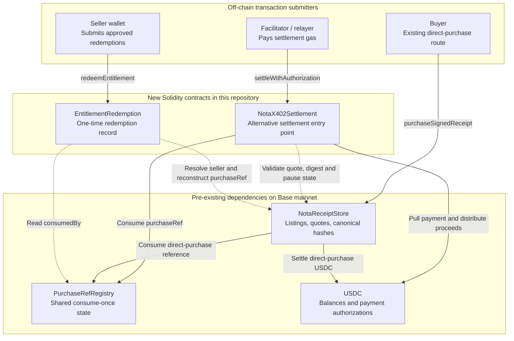

# Nota Entitlements

A receipt you can spend once — and only the wallet that paid for it can spend it.

A plain payment proves money moved. It does not say what was bought, and it does not
entitle anyone to collect it. When an agent buys a paid API resource, nothing connects
the USDC transfer to what the seller agreed to deliver or to who may claim it. This is
for developers building purchasing agents and merchants selling paid API resources.

The buyer generates a redemption bundle and shares it privately with the merchant; the
Nota store hashes it into a public purchase reference. The seller signs a quote
committing to that reference. The buyer pays USDC with an EIP-3009 authorization, so a
facilitator submits the transaction and the buyer sends none. Later the buyer presents
the bundle: the merchant's endpoint checks that the presenting wallet is the one that
paid, and the seller submits the redemption, which the contract records once for that
redemption deployment.

- **Attacker** with the buyer's exact bundle → `403 BUYER_MISMATCH`, no transaction
- **Buyer** with the same bundle → `201`, redeemed, `EntitlementRedeemed` emitted
- **Buyer again** → `409 ALREADY_REDEEMED`, no second transaction

<!-- TODO: add a "Demo video" link after the showcase link once it has a public URL. -->
[ETHGlobal showcase](https://ethglobal.com/showcase/nota-entitlements-88xhn) · [Mainnet settlement](https://basescan.org/tx/0xa5ad9c2e638590a3aa5ef29ca7d5fa99cd98d48f697640ae1b7e506f7473384e) · [Redemption](https://basescan.org/tx/0x59207b64629b4bff88e5198fc66045bb9bd1429dc3c6b7296f4a2d61a4905194) · [Subgraph](https://thegraph.com/studio/subgraph/nota-entitlements) · [Live run record](./deployments/base.json)

Built during ETHOnline on top of the pre-existing Nota protocol ([BASELINE.md](./BASELINE.md)).
The demo video runs on a local Base fork; the settlement, redemption, subgraph and run-record
links are a separate, real Base mainnet purchase ([fork vs. real](#fork-walkthrough-and-real-purchase)). Authentication
is a mock wallet seam; World registration is pending — see
[World integration status](#world-integration-status).

## How the demo runs

1. **Offer** — HTTP 402 with the seller-signed quote; the client verifies the bundle commitment and the line-item total before signing anything.
2. **Payment** — EIP-3009 authorization; the facilitator relays and pays gas; the buyer sends no transaction and holds zero ETH on the fork.
3. **Entitlement** — the buyer signs an access challenge and receives the report; after a server restart it recovers the same bundle without paying again.
4. **Attacker** — B presents A's bundle and is rejected at the buyer check, before any transaction.
5. **Redemption** — A redeems once through a seller-submitted transaction; A's fresh retry is rejected by the endpoint, with no second transaction.
6. **Record** — prints the links and Graph query for the separately recorded mainnet purchase, whose settlement and redemption the index joins by `purchaseRef`.

```sh
npm run demo:connected -- --story   # disposable Base fork; needs exported BASE_RPC_URL
npm run demo:redemption             # local chain only; no RPC
```

### Fork walkthrough and real purchase

**The demo video is recorded on a disposable Base fork.** The real deployed Nota
store, registry and USDC are forked locally, the two new contracts are deployed
locally, the buyer pays 10 test USDC, and every transaction hash in the walkthrough
belongs to the fork. Nothing in the video spends real funds.

**The same flow also ran once for real on Base mainnet**, on 2026-09-12: listing 2,
0.10 USDC, the same three outcomes (403 / 201 / 409), and no transaction sent by the
buyer. See the [settlement](https://basescan.org/tx/0xa5ad9c2e638590a3aa5ef29ca7d5fa99cd98d48f697640ae1b7e506f7473384e),
the [redemption](https://basescan.org/tx/0x59207b64629b4bff88e5198fc66045bb9bd1429dc3c6b7296f4a2d61a4905194),
the [recorded evidence](./deployments/base.json) and the
[subgraph query](#query-the-recorded-purchase). That run was recorded before story
mode was committed (`14864c8`), so it has no narration. Act 6 of the fork walkthrough
switches to it explicitly. The recorded evidence blocks another paid run; see
[Connected demo on deployed Base mainnet contracts](#connected-demo-on-deployed-base-mainnet-contracts).

## Contents

- [Quickstart](#quickstart)
- [Demo outcomes and enforcement](#demo-outcomes-and-enforcement)
- [Architecture](#architecture-at-a-glance)
- [Continuity boundary and deployments](#continuity-boundary)
- [Public evidence with The Graph](#public-evidence-indexing-with-the-graph)
- [Trust boundaries and limitations](#trust-boundaries-and-limitations)
- [World integration and sponsor boundaries](#world-integration-status)

## Quickstart

Use **Node.js 22** (workspace minimum **20.19**), npm, Git, and **Foundry 1.8.1**
including Forge and Anvil, matching [CI](./.github/workflows/test.yml).
From a new directory:

```sh
git clone --recurse-submodules https://github.com/notaxyz/entitlements.git
cd entitlements
git submodule update --init --recursive
npm ci
forge build
npm run typecheck
npm test
```

The recorded Git submodules are forge-std
`886b4f8b63409ef474542de6394d25a9b5908ed3` and OpenZeppelin Contracts v5.1.0
`69c8def5f222ff96f2b5beff05dfba996368aa79`
([.gitmodules](./.gitmodules), [foundry.lock](./foundry.lock)).
Do not substitute latest dependency revisions.

**Plain ZIP:** source archives omit submodule contents and project Git history.
`npm ci` alone does not populate Solidity dependencies. Prefer a fresh Git clone
above, outside your extracted directory, rather than initializing an unrelated Git
history or guessing dependency versions. An archive is not Continuity history evidence.

**Repeatable connected demo:** configure a trusted Base RPC in your shell/secret
manager, then export it. TypeScript scripts do **not** load `.env` automatically.
Do not put credential-bearing URLs, keys or bundles in command history or recordings.

```sh
# BASE_RPC_URL must already hold your configured endpoint.
export BASE_RPC_URL
npm run demo:connected -- --story
```

This starts a disposable Base fork and local services; no live keys or funds are
needed. The fork buyer pays **10 test USDC** and sends no transaction. Six Enter
pauses require a TTY. Without `--story`, output is automatic JSON. Act 6 switches
explicitly to a **different, recorded 0.10-USDC mainnet purchase** and prints (but
does not execute) its Graph query.

Without Base RPC, `npm test` runs deterministic/local-EVM tests and skips only the
Base-fork suites. `npm run demo:redemption` is an automatic standalone local-mock
redemption demo: no Base RPC, no story flag, no connected checkout or restart recovery.
See [manual-service configuration](./packages/README.md#manual-service-configuration)
for the different server environment variables.

## Demo outcomes and enforcement

These are sequential redemption attempts after one paid purchase, not three purchases.

| Attempt | Enforcing component | HTTP | Code | Policy step | Additional redemption transactions |
| --- | --- | --- | --- | --- | --- |
| B signs with B's wallet and presents A's exact bundle while unredeemed | Merchant endpoint compares authenticated wallet with settlement buyer | 403 | `BUYER_MISMATCH` | 6 | 0 |
| A signs and presents its bundle | Endpoint verifies order/buyer; contract checks seller, accepted consumer and replay | 201 | `REDEEMED` | 7 (submission/confirmation) | 1, sent by seller; `EntitlementRedeemed` verified |
| A retries with a fresh signed challenge | Endpoint reads on-chain `redeemedAt` before submission | 409 | `ALREADY_REDEEMED` | 5 | 0 |

The replay response is **not an on-chain reverted transaction**. A fresh challenge
ensures the request reaches the redemption-state check rather than merely failing
authentication. B goes first to exercise buyer policy while redemption is still
available. The table's step numbers refer to the endpoint's check sequence; success
logs step 7. [Source assertions](./packages/e2e/src/connected-demo.ts) and the
[local-EVM replay test](./packages/resource-server/test/redemption.anvil.test.ts)
check the emitted event, seller nonce, and absence of extra transactions.

Payment, authenticated content access, and redemption are distinct. The report is
already served before the attacker/buyer/replay attempts. Re-fetch uses a new access
challenge, not another payment or redemption. Redemption neither erases the delivered
file nor proves that off-chain fulfillment occurred.

## Architecture at a glance

The architecture has three layers: the existing Nota protocol on Base, two new
Solidity contracts that reuse it, and off-chain services that handle quotes,
transaction submission, and buyer authentication.

This is a dependency and call map. Both new contracts are now deployed and source-verified
on Base mainnet; the deployment record below distinguishes them from the pre-existing baseline.
Deployment alone does not mean the backend, World authentication, or live subgraph is ready.
Solid arrows are state-changing calls; dotted arrows are reads. USDC arrows denote
token-contract calls, not transfers of ETH.



There is deliberately **no adapter-to-redemption call**. Settlement and redemption
are separate transactions, connected by `purchaseRef` and shared registry state.
The adapter does not call the store's purchase function: it calls the store's
validation views, then settles through USDC and the registry itself.

A reference can be paid through either the original store or an accepted adapter,
then redeemed through the same entitlement contract. Redemption neither charges
the buyer again nor consumes the registry reference a second time.

### Contract responsibilities

| Component | Origin | Responsibility | Relevant state / output |
| --- | --- | --- | --- |
| `NotaReceiptStore` | Pre-existing | Resolves listings and sellers, validates quotes, supplies canonical hashes and fee breakdowns; also supports direct purchases | Listings; `ReceiptPurchasedV2` on its own purchase path |
| `PurchaseRefRegistry` | Pre-existing | Allows authorized settlement modules to consume a reference once | `authorizedConsumers`, `isConsumed`, `consumedBy` |
| USDC | Pre-existing | Holds balances and verifies buyer payment authorizations | Balances; token authorization-use state |
| [`NotaX402Settlement`](./src/NotaX402Settlement.sol) | New | Settles a bound quote using EIP-3009, consumes its reference, distributes proceeds | `nextAdapterReceiptId`; `X402ReceiptSettled` |
| [`EntitlementRedemption`](./src/EntitlementRedemption.sol) | New | Checks seller, accepted consumption, and replay; records redemption | Fixed accepted-consumer set; `redeemedAt`; `EntitlementRedeemed` |

Neither new contract is a proxy or an upgrade to the deployed store. Neither has
an owner, an independent pause switch, or upgradeability. Redemption moves no funds;
successful adapter settlements distribute the gross payment within the same
transaction. Tokens accidentally sent to these contracts are not supported deposits
and have no recovery mechanism.

#### Minimal interfaces, not copied protocol code

[`src/interfaces/`](./src/interfaces) contains ABI boundaries to the existing
deployments, not vendored Nota implementations:

- `INotaReceiptStore`: listing lookup, canonical reference reconstruction, registry lookup.
- `INotaSignedQuoteStore`: extends that interface with signed-quote validation,
  quote hashing, token lookup, and store configuration views.
- `IPurchaseRefRegistry`: consumption and attribution; owner authorization is exposed
  for deployment tooling and tests, not as an entitlement-contract admin function.
- `IEIP3009`: the token's `receiveWithAuthorization` surface and related views.

Local Solidity mocks are test fixtures only. Production integration targets the
deployed ABI; Base fork tests check compatibility with the real contracts.

### x402 settlement adapter

The adapter validates seller quotes through the existing store, binds the buyer's
EIP-3009 authorization to that exact quote, consumes the reference in the registry,
and distributes USDC atomically. The facilitator sends the transaction and pays gas.
See [call sequence, accounting and signature boundaries](./documentation/ARCHITECTURE.md#x402-settlement-adapter).

### Entitlement redemption

The contract requires the listing seller, consumption by an accepted settlement
module, and an unredeemed reference. It does not authenticate the buyer. The endpoint
adds buyer matching and verifies settlement against the merchant's saved order.
See [contract checks and endpoint sequence](./documentation/ARCHITECTURE.md#entitlement-redemption).

### References, events, and replay protection

Join either store or adapter settlements to redemption by `purchaseRef`, not
module-local receipt IDs. The hash does not commit to listing ID; the endpoint checks
listing separately. Replay state belongs to a specific redemption deployment.
See [event identities, state transitions and nonce visibility](./documentation/ARCHITECTURE.md#references-events-and-replay-protection).

### Backend architecture

| Module | Role | Relevant boundary |
| --- | --- | --- |
| [`packages/x402-nota`](./packages/x402-nota/src) | Shared ABIs, quote types, metadata hashing, nonce derivation, trust configuration | Typed integration with the configured Nota deployment |
| [`packages/client`](./packages/client/src) | Checks purchase terms and deployment configuration, signs payment, retrieves paid content | Does not trust contract addresses merely because a 402 response names them |
| [`packages/resource-server`](./packages/resource-server/src/index.ts) | Issues buyer-bound quotes; releases paid content/bundle after buyer authentication | A public purchase reference is not authentication |
| [`packages/facilitator`](./packages/facilitator/src) | Submits allowed adapter settlements and pays gas | Relayer key is not the buyer's key or redemption authority |
| [`resource-server/src/redemption`](./packages/resource-server/src/redemption) | Separate redemption HTTP service, authorizer seam, chain verification, seller writer | Enforces authenticated-wallet == receipt-buyer before seller submission |

The client and connected demo generate a fresh preimage bundle **on the buyer side
before requesting a quote**. They POST it to the report URL with `X-PAYER`; the
merchant uses the deployed store's canonical hash helper, persists the order, and
returns a buyer-bound HTTP 402 quote without the bundle. Before authorizing payment,
the client independently calls the trusted store's helper and rejects a quote that
does not commit to its original bundle. Legacy GET checkout remains available with
merchant-generated bundles; the client does not silently fall back to it.

Buyer-generated does **not** mean buyer-exclusive: the merchant receives and stores
the bundle, and the configured RPC receives it when computing the canonical hash.
Use trusted endpoints, HTTPS, private order storage, and disable request-body logging
at reverse proxies/APM as well as in the application. The client refuses non-HTTPS
checkout URLs except loopback development and refuses checkout redirects. Public
payment messages still carry only the commitment; redemption later publishes the
bundle in transaction calldata.

`AgentConfig.onBundleCreated` is an optional asynchronous hook for privately retaining
the buyer's copy before checkout. A failed hook aborts before any request or payment.
Without it, that copy is in memory until `payAndFetch` returns it. The fork demo uses
in-memory buyer retention; live mode saves a private recovery copy before checkout.
Neither is a production buyer wallet vault. Authenticated paid access
can still recover the merchant-held copy after a merchant restart. Buyer binding is
to the wallet signing payment; World registration remains a separate pending check.

#### Persistent issued orders

Both server entry points require **`QUOTE_STORE_PATH`**, set to the same absolute
path on persistent storage (for example, an `issued-orders.json` file in a private
directory). The resource server saves each order **before returning its signed
quote**. Restarting the service preserves the order and its bundle; outstanding
authentication challenges still expire or are lost on restart.

The file store serializes writes within one process and atomically replaces the
file, with owner-only file permissions. Failed writes are not published as saved
orders. Redemption reads the file afresh, so a separately running service sees new
orders without a restart. Missing orders fail closed; corrupt or unreadable storage
produces a sanitized error, not an automatic memory fallback.

Run **one resource-server writer per order file**. Multiple writer processes or
hosts need a database or cross-process coordination, which this file store does not
provide. Keep a separate file per merchant/deployment, protect and back it up as
secret material, and do not commit it: it contains redemption preimage bundles.
Memory stores remain available for isolated tests; the server commands never default
to them. The connected Base-fork demo below uses this file-backed path for both services.

The wire scheme is **`nota-exact`**, not generic x402 `exact`. This is a Nota-aware
settlement path with an adapter allowlist, not a generalized facilitator. On-chain
Nota receipts are also distinct from off-chain signed offers/delivery attestations;
the repository does not implement or claim tested interoperability with x402's
optional Signed Offers & Receipts extension. See [packages/README.md](./packages/README.md)
for the paid-resource protocol.

## Continuity boundary

During the event we built the EIP-3009 settlement adapter, entitlement contract,
buyer-authenticated backend, restart recovery, connected demo, and Graph event index
over the [pre-existing Nota protocol](./BASELINE.md).

**Provenance:** [baseline](./BASELINE.md), [event contribution history](#event-contributions-and-source-snapshot),
and [AI assistance / available prompts](./documentation/AI_USAGE.md).

The receipt protocol predates ETHOnline 2026. Its baseline is [`notaxyz/contracts@238cb210`](https://github.com/notaxyz/contracts/tree/238cb210e1342892c122b794563b1db99bd4b891), including seller-signed EIP-712 quotes, USDC settlement, `ReceiptPurchasedV2`, and global one-time purchase-reference consumption.

[`BASELINE.md`](./BASELINE.md) records the timestamped boundary, deployed addresses, and the work introduced here. This repository does not vendor or modify Nota's existing contracts.

### Event contributions and source snapshot

History below comes from this repository's Git log. The last feature commit before
the documentation restructure is [`14864c8`](https://github.com/notaxyz/entitlements/commit/14864c8a32c7aba5ccccf02fd385797a3e0a5ef5)
(2026-09-13); story-mode HTTP route logging and the documentation restructure followed
the same day. The commit named in the ETHGlobal submission is the submitted snapshot;
it is not the older contract-deployment commit.

| Git date | Contribution | Evidence commit(s) |
| --- | --- | --- |
| 2026-09-06 | Baseline record, Foundry scaffold, redemption, tests, trust boundaries, pinned CI formatter | `761f165`, `785c4c9`, `564fb57`, `51cf9ab`, `632244e`, `c3f772d` |
| 2026-09-07–09 | EIP-3009 adapter, ERC-1271 buyers, accepted consumers, quote-bound nonce, client/facilitator/resource server, access authentication, trust checks, quote persistence | `e340f92`, `ac398fd`, `a4809ad`, `b55df07`, `8f3bbce`, `5df499a`, `ba1ca30`, `90e7f23`, `7105fe3`, `1d843d2`, `a3a6742` |
| 2026-09-10 | Buyer-bound redemption endpoint, persistence/order checks, connected fork demo | `32ae8eb`, `12768cb`, `082b752`, `88e9b16` |
| 2026-09-11 | Graph mappings and preflight preparation; buyer-generated checkout | `6febc41`, `8cc0b37`, `d618b3d` |
| 2026-09-12 | Recorded Base deployments, Studio configuration/ABI fix/verification, live mode, preflight and public demo evidence | `8dae0e7`, `7c116cf`, `5e9d14b`, `5ddd34d`, `554da3d`, `5b60732`, `76eb742` |
| 2026-09-13 | Six-act story presenter, cancellation handling and tests; story HTTP route logging; documentation restructure | `14864c8` and later commits |

Inspect with `git log --reverse --stat` or `git show <commit>`. Dates are the
commit-local dates Git records (the author's timezone varies between +0330, +0200
and +0300), not independent proof of when every line was authored. The contract
deployment record pins `d618b3d`; later live-demo and story work is **not** attributed
to that older deployment commit. [BASELINE.md](./BASELINE.md) remains unchanged as
historical evidence, distinct from this current contribution summary.

### Base mainnet dependencies

| Contract | Address |
| --- | --- |
| `NotaReceiptStore` | [`0xf6062F3F52D3E19cb9cc3e027491a5c11D101F88`](https://basescan.org/address/0xf6062F3F52D3E19cb9cc3e027491a5c11D101F88) |
| `PurchaseRefRegistry` | [`0x9AaFfA5787ca332a40B9C98E3e5323A97F96D991`](https://basescan.org/address/0x9AaFfA5787ca332a40B9C98E3e5323A97F96D991) |
| USDC | [`0x833589fCD6eDb6E08f4c7C32D4f71b54bdA02913`](https://basescan.org/address/0x833589fCD6eDb6E08f4c7C32D4f71b54bdA02913) |

Both constructors discover the purchase-reference registry from the receipt store;
the adapter also discovers the settlement token there. Redemption additionally takes
the fixed list of accepted settlement consumers.

#### New Base mainnet deployments

The two new contracts were deployed on **2026-09-11** from commit
`d618b3dabcc2aa861ac0350ab728f5e6ba8b56c6`. Full transaction hashes, block hashes,
UTC timestamps, constructor arguments, compiler settings, and bytecode hashes are
recorded in [`deployments/base.json`](./deployments/base.json), using the field
conventions of the existing contracts repository. The original `BASELINE.md` is unchanged.

| Contract | Verified address | Deployment block |
| --- | --- | --- |
| `NotaX402Settlement` | [`0x59D3076857972372ecc2E845a7e57A83BB9ddDC8`](https://basescan.org/address/0x59D3076857972372ecc2E845a7e57A83BB9ddDC8#code) | [51,184,074](https://basescan.org/tx/0xd305282b6ea7d7a5efbf3000f987652a01b858b6be5c63207902e2ae1c72d984) |
| `EntitlementRedemption` | [`0xDE4F712fa5B5be32766C34885b334F1D8e573882`](https://basescan.org/address/0xDE4F712fa5B5be32766C34885b334F1D8e573882#code) | [51,184,221](https://basescan.org/tx/0x4a53b7d49bf748fb0f2b389cc19e8e8fdfc6888d6145f46d33766f4bd846a3da) |

The registry owner authorized the adapter in [transaction `0xe4bd8708…632d7f`](https://basescan.org/tx/0xe4bd870886def028ea45a0aed2c319f327dd23324b7c389eec04490b1f632d7f)
at block **51,184,168**. RPC checks confirmed both contracts' store/registry wiring,
the adapter's USDC address, and redemption's fixed accepted set of **store + adapter**.
Both creation transactions match the local compiled artifacts plus the recorded
constructor arguments. Source verification is not a security audit.

The deployment snapshot above predates the **2026-09-12 public purchase and redemption**.
Both manifests now contain that demo and its Studio event-verification record. Studio
publication is not decentralized-network publication; World verification is still absent.
Test fixtures deploy local instances; their transactions are not public-chain evidence.

### Deployment

Both new contracts and registry authorization are already recorded above. Deployment
order is adapter → registry authorization → redemption with adapter accepted.
Do not redeploy to record the demo. [Operator procedures](./documentation/OPERATIONS.md#deployment)
explain both permission gates and why a new redemption deployment changes replay scope.

## Public evidence indexing with The Graph

**Recorded status, reviewed 2026-09-13:** Studio deployed; mainnet settlement and
redemption for listing 2 (0.10 USDC) matched the index on 2026-09-12. Both manifests
have `publicDemo`, `newPublicPurchaseAndRedemptionDemoRecorded: true`, and
`publicDemo.indexVerification.status: EVENTS_INDEXED_AND_MATCHED`.

- [Base deployment and demo evidence](./deployments/base.json)
- [Studio deployment and verification provenance](./deployments/subgraph-base.json)
- [Studio explorer](https://thegraph.com/studio/subgraph/nota-entitlements)
- [Query endpoint](https://api.studio.thegraph.com/query/1753681/nota-entitlements/v0.0.1)

The recorded mainnet reference is
`0xb3368376783682607e36f2c62fc198957bddea962dd42f20af05a0ffd57e6b94`.
Its settlement at block **51,220,814**, log **247**, and redemption at block
**51,220,820**, log **702**, were checked at indexed block **51,221,518**.
This documents one purchase, not current availability, completeness or a fresh query.

### Query the recorded purchase

Paste this into the **Playground** tab of the [Studio subgraph](https://thegraph.com/studio/subgraph/nota-entitlements),
or POST it to the query endpoint above. It is the query story mode prints in Act 6,
plus index health (`_meta`):

```graphql
{
  _meta { deployment hasIndexingErrors block { number } }
  purchases(where: { purchaseRef: "0xb3368376783682607e36f2c62fc198957bddea962dd42f20af05a0ffd57e6b94" }) {
    purchaseRef buyer seller amount metadataHash
    settlements { kind emitter transactionHash blockNumber }
    redemptions { redemptionContract transactionHash redeemedAt }
  }
}
```

A run on **2026-09-13** (deployment `QmQ4y2Co…NnQp`, index at block 51,248,802,
`hasIndexingErrors: false`) returned one purchase:

| Field | Returned | Meaning |
| --- | --- | --- |
| `amount` | `100000` | 0.10 USDC (six decimals) |
| `buyer` | `0x41f14bbee2936c3cb21fda7f56f66972bb4fa1d4` | Buyer A's wallet |
| `seller` | `0x6207cadc1a3af0e1a2ff0f7fdb80793e84596fde` | Listing seller, which submits redemptions |
| `settlements` | One `X402_ADAPTER` settlement from `0x59d3…ddc8`, block 51,220,814, tx [`0xa5ad…384e`](https://basescan.org/tx/0xa5ad9c2e638590a3aa5ef29ca7d5fa99cd98d48f697640ae1b7e506f7473384e) | Paid through the new adapter |
| `redemptions` | One from `0xde4f…3882`, tx [`0x5920…5194`](https://basescan.org/tx/0x59207b64629b4bff88e5198fc66045bb9bd1429dc3c6b7296f4a2d61a4905194), `redeemedAt` `1789230987` (2026-09-12 16:36:27 UTC) | Redeemed once on this deployment |

The single redemption row matches the demo: the replay attempt was rejected by the
endpoint and sent no transaction. The fork walkthrough's own purchase (10 test USDC)
exists only on the local fork and never appears here. This is public evidence to
inspect; the application itself does not read the index.

The earlier snapshot at **51,208,878** still correctly records one baseline store
settlement, zero adapter settlements and zero redemptions. Its original fields,
block hashes and timestamps are preserved. [Historical snapshots and index operations](./documentation/INDEXING.md)
explain the distinct checks and scopes.

The index joins public settlement and redemption events. It never reads bundle
calldata or authorizes redemption. **The backend does not query the live subgraph**;
the report is illustrative, not Graph analytics. Story mode prints a query without
executing it; fork Act 6 uses the separate recorded mainnet reference. Studio is not
published to the decentralized network. World registration and deployment-tool
advisory resolution remain unverified. No free-gas or free-query claim is made.

## Trust boundaries and limitations

**Scope of the demonstration.** These qualify the summary at the top of this README:

- **Authentication:** genuine EOA signatures in `mock-wallet` mode, `humanVerified=false`;
  not World/AgentBook verification. "The wallet that paid" means wallet control, not a
  verified agent or human identity.
- **Buyer:** a programmatic client, not demonstrated LLM reasoning.
- **Content:** the concrete demo buys an **illustrative Base USDC flows report**. The
  report is delivered **before redemption**, is not live Graph analytics, and is not a
  one-time download.
- **Who can spend it:** buyer matching is merchant-endpoint policy; the seller can bypass
  it. The bundle is shared with the merchant and its RPC at checkout and published in
  redemption calldata; it is not buyer-exclusive.
- **Once:** on-chain replay protection is **per redemption deployment**. The demo's
  replay is rejected by the endpoint (HTTP 409) before any transaction, not by an
  on-chain revert.
- **Record:** story mode prints the Graph query; it does not execute it, and the fork
  purchase never appears in the public index.
- No fulfillment or sponsor-qualification claim is made.

**Protocol and operational boundaries:**

- **Registry authorization and redemption acceptance are different gates.** The
  registry owner authorizes an adapter to consume new references. The redemption
  constructor fixes which consumers count as payment. The backend additionally
  pins which event emitters it trusts.
- **No new admin does not mean no upstream controls.** Store pause state can stop
  new adapter purchases; the registry owner can revoke adapter consumption.
  These do not erase prior consumption or redemption records.
- **The seller remains trusted for redemption policy.** A seller can bypass the
  endpoint and call the contract directly. The contract does not enforce buyer
  binding, World verification, or off-chain fulfillment.
- **Redeployment changes the replay domain.** A new accepted-consumer list requires
  a new redemption deployment with empty redemption state. Migration must account
  for entitlements already redeemed against older addresses.
- **The current backend is a development milestone.** Mock mode requires explicit
  opt-in and refuses `NODE_ENV=production`. It supports EOA authentication only,
  uses in-memory challenges and a single-process seller queue, and needs durable
  coordination and abuse controls before production operation.
- **Fail closed on uncertain submission.** A lost broadcast/confirmation response
  blocks further seller submissions until reconciled. Do not restart and retry
  blindly. RPC trust, confirmation policy, and reorg risk still apply.
- **Do not overclaim identity.** Mock signatures prove wallet control, not a verified
  or unique human. World status is tracked separately below.

See [SECURITY.md](./SECURITY.md) for detailed assumptions, logging restrictions,
upstream dependencies, and non-guarantees.

## Development

### Connected purchase-to-redemption demo

With Node.js 22 (minimum 20.19), Foundry/Anvil (CI pins 1.8.1), initialized submodules, and `npm ci`:

```sh
export BASE_RPC_URL   # already configured in your shell/secret manager
npm run demo:connected
```

The command starts a **disposable local Base fork** and uses the real deployed
Nota store, registry, and USDC code/state as its starting point. It builds and deploys
the unchanged adapter and redemption contracts locally, authorizes the adapter by
impersonating the registry owner **on the fork only**, and starts the resource,
facilitator, and mock-authenticated redemption HTTP services. The buyer is funded
with fork USDC and no ETH. No wallet keys or pre-existing receipt bundle are needed.

It exercises one purchase end to end:

1. Buyer A generates its bundle, POSTs it privately, receives HTTP 402 with a buyer-bound quote, and verifies its bundle commitment and purchase terms.
2. A signs the EIP-3009 authorization; the facilitator submits settlement and pays gas.
3. A signs an access challenge and receives the resource; the client retains A's original bundle.
4. The resource server restarts; A recovers the same purchase without paying again.
5. B presents A's exact bundle before redemption: `403 BUYER_MISMATCH`, step 6, no transaction.
6. A uses that bundle: `201`, with the actual `EntitlementRedeemed` event verified.
7. A retries: `409 ALREADY_REDEEMED`, step 5, no second redemption transaction.

The runner asserts one quote, one settlement, the same `purchaseRef` throughout,
USDC movement, and an unchanged buyer transaction count and zero ETH balance.
It checks anonymous access is denied and that the bundle is absent from the 402,
settlement request, demo transcript, and redemption audit logs. The transcript prints
only selected public fields; errors do not dump response bodies or RPC calldata.

**Limits:** requester authentication is still `mock-wallet`, with `humanVerified: false`.
The bundle is freshly **buyer-generated**, shared with the merchant through checkout,
and kept in memory by the demo buyer. Real World authentication remains unfinished.
Walkthrough transaction hashes belong to the local fork. Story Act 6 separately labels
links for the previously recorded mainnet purchase; they are not this fork's transactions.
Services, fork state, and the temporary issued-order file are disposed after the run.
This command requires a working Base RPC and fails rather than silently switching to mocks.

The same runner is exercised by `packages/e2e/test/connected-flow.test.ts`. That
integration test skips without `BASE_RPC_URL`; deterministic backend and local-EVM
tests continue to run without an external RPC. Scripts do not automatically load `.env`.

### Recording with story mode

```sh
npm run demo:connected -- --story         # disposable fork, no real spending
npm run demo:connected -- --live --story  # currently blocked by existing publicDemo records
```

An interactive terminal is required. Six title cards cover **offer → payment →
entitlement → attacker → redemption → record**, with an Enter pause after each act.
Without `--story`, the JSON transcript and unattended flow are unchanged. Story mode
only observes the existing flow and awaits its step callbacks; it does not buy again,
submit a replay transaction, or query the index.

Act 1 independently checks the inline metadata hash and line-item total before its
pause; the client still performs all its normal bundle, deployment and seller-quote
checks before signing. Advance this first pause within the existing 15-minute quote
window; expiration fails closed, with no automatic re-quote or payment retry. The other
pauses are outside live authentication challenges. Buyer ETH is printed as measured
(zero on the fork, possibly nonzero on Base), with the unchanged transaction count.

The bundle is buyer-generated and recovered after authenticated access, not created
by the payment response. Possession alone is insufficient: the endpoint also checks
the buyer wallet. Replay is rejected **by the endpoint using on-chain `redeemedAt`**,
without a second transaction; the video must not call it an on-chain reverted replay.
Authentication remains mock-wallet, not World verification.

The cards show the verified line-item amounts, metadata hash, buyer wallet and
transaction count, gas payer, and the attacker/replay rejection reasons. No bundle
values or arbitrary metadata text are printed.

Story mode also prints each actual application HTTP method, endpoint and response
status: checkout, settlement, access challenges/GETs, and redemption challenges/POSTs.
Only known application routes are shown; credentials, URL query strings/fragments,
request bodies, proof headers and RPC URLs are excluded. The final Graph endpoint
is still a query to run manually, not an HTTP request made by the demo.

The final act prints the Studio endpoint, public `purchaseRef` and a query to paste.
On a fork it explicitly switches to the **separate, previously recorded mainnet
purchase** in `deployments/base.json`, with its settlement/redemption links and
mainnet query. The walkthrough's local reference is labeled separately: it will
not appear in the public index. In live mode the query uses the current purchase.
No query is executed or fresh indexing-success claim made; live indexing may lag.
Public transaction URLs are printed on their own lines.

Ctrl-C stops at a completed step or prompt and releases the live run lock; confirmed
transactions are not undone and private recovery files remain. During an in-flight
operation cancellation waits for a safe boundary. An uncertain RPC/send failure still
retains the lock. After any partial run, reconcile the transaction journal before
retrying: a new run is a new purchase, not a resume. Existing recorded-demo and
state-directory guards remain in place; `--story` does not bypass them. Nothing is
committed automatically.

### Connected demo on deployed Base mainnet contracts

**Current snapshot: both manifests already contain `publicDemo`.** The CLI rejects
another paid run after local configuration checks, before RPC preflight and the
confirmation prompt. `--live` and `--live --story` are not repeat-recording shortcuts.
There is no force/reset/resume/yes flag; preserve the guard and the existing evidence.

Use `npm run demo:connected -- --story` with exported `BASE_RPC_URL` for a repeatable
fork recording. [Live operator reference](./documentation/OPERATIONS.md#connected-demo-on-deployed-base-mainnet-contracts)
records configuration, confirmation, transaction journaling and recovery constraints.

### Redemption backend demo

With Node.js 22 recommended (minimum 20.19), Foundry/Anvil 1.8.1, and initialized submodules:

```sh
git submodule update --init --recursive
npm ci
npm run demo:redemption
```

This starts a fresh local Anvil chain, builds and deploys the unchanged adapter and
redemption contracts with existing mock Nota/token dependencies, and makes a new
buyer-bound purchase using a buyer-generated preimage bundle. It proves:

- Agent B with agent A's bundle: `403 BUYER_MISMATCH`, step 6, no transaction.
- Agent A with the correct bundle: confirmed `EntitlementRedeemed` event.
- Agent A again with a fresh signed challenge: `409 ALREADY_REDEEMED`, step 5, no transaction.

The attacker runs first so the rejection demonstrates buyer binding, not replay
protection. This is a local wallet-authentication demo, **not** a Base-mainnet purchase
or a World-verified agent demo. The mock store does not validate seller signatures;
deployed-store compatibility remains covered separately by the Base fork suites.
`npm test` always runs the new HTTP/signature and local-EVM suites without an external
RPC; missing Foundry is a failure, never a silent skip.

See the [endpoint runbook](./packages/resource-server/REDEMPTION.md) for configuration,
request signing, trust boundaries, and deployment limitations.

### Contracts

The project uses Foundry and Solidity 0.8.24. Clone with submodules; the adapter uses OpenZeppelin's `SafeERC20` and `ReentrancyGuard`.

```sh
git submodule update --init --recursive
```

```sh
forge build
forge test
```

### Verification layers

| Suite | What it proves | External RPC? |
| --- | --- | --- |
| Solidity deterministic tests | Contract guards, authorization binding, fee accounting, events, and replay | No |
| TypeScript unit / HTTP tests | Signed challenges, ordered policy checks, event decoding, concurrency, log redaction | No |
| TypeScript local Anvil tests | Real adapter/redemption transactions, no transactions on policy rejection, uncertain-broadcast handling | No; starts its own Anvil |
| Base fork suites | Compatibility with the deployed store, registry, and USDC, including signature/domain validation | Yes; skip without `BASE_RPC_URL` |

```sh
forge fmt --check
npm run typecheck
npm test
# Include TypeScript Base compatibility tests (BASE_RPC_URL already configured):
export BASE_RPC_URL
npm test
```

The mock store does not verify seller signatures—it exposes the validation result
as a test control. Deployed-store compatibility is a fork-suite concern. The fork
tests exercise the real store's seller-signature validation, deployed USDC's
EIP-3009 authorization checks, registry-owner adapter authorization, and the path
from adapter settlement to redemption. Domain separators are checked against the
deployed contracts rather than inferred from the mocks.

```sh
export BASE_RPC_URL   # Solidity fork tests read it through vm.envOr
forge test
```

CI pins Foundry to the version in [.github/workflows/test.yml](./.github/workflows/test.yml)
(currently 1.8.1). Match that version locally; formatter output differs between versions.

Receipt #1 supplies the consumed reference used for deployed-contract compatibility testing without committing its redemption preimage bundle:

```text
listing:      1
purchaseRef:  0x5333d780992fdf98c143083b765392aeaa27cb393a034235026f57f202806770
```

For the optional receipt-#1 tests, supply `RECEIPT_1_RAW_PURCHASE_REF` and
`RECEIPT_1_PURCHASE_REF_NONCE` through a secure local environment. Do not put real
values in shell commands, screenshots or logs. Export `BASE_RPC_URL` for child
processes. Copying `.env.example` to `.env` does not configure TypeScript scripts.

Bundle-dependent integration tests skip when either receipt variable is absent. The remaining fork tests still exercise caller authorization, unpaid references, and nonexistent listings against the live deployment.

Never commit `.env`, a redemption preimage bundle, `out/`, or `cache/`.
The TypeScript scripts do not automatically load `.env`; export their configuration
securely as described in the existing [redemption runbook](./packages/resource-server/REDEMPTION.md).

## World integration status

`AgentAuthorizer` is the integration seam. `MockAgentAuthorizer` is implemented and
tested. `WorldAgentKitAuthorizer`, AgentBook lookup, and registered buyer/attacker
agents remain pending. The mock's `humanId` is synthetic, and responses identify
`authentication: "mock-wallet"` with `humanVerified: false`.

[WORLD_FEEDBACK.md](./WORLD_FEEDBACK.md) records registration friction, the documentation
disagreement about registry/network defaults, and the draft questions for World.
It is not evidence that a message was sent or that registration succeeded.

The connected demo now uses a new buyer-generated preimage bundle and binds the quote
to buyer A's signing wallet. The final World demonstration must additionally authenticate
that wallet through AgentKit and exercise real registered agents. Receipt #1 and the local mock demo establish different things and cannot
substitute for that verification. No automatic World-to-mock downgrade is implemented.

## Sponsor boundaries and submission information

Official pages checked **2026-09-13**; eligibility is not established by this README.

- [World AgentKit Continuity](https://ethglobal.com/events/ethonline2026/prizes/world)
  requires meaningful AgentKit use, a working app, AgentBook registration/resolution
  where relevant, Sandbox App testing and feedback. This checkout has the mock seam
  and feedback notes, not the unfinished World implementation or sandbox evidence.
- [The Graph AI Continuity track](https://ethglobal.com/events/ethonline2026/prizes/the-graph)
  requires The Graph to be integral to AI tooling or an agent/app's live data use,
  plus meaningful work with that data, not simply printing a query result. Our
  custom subgraph and recorded event checks are implemented; the application does
  not consume Graph data. The composable/standardized-products track separately
  requires product composition or meaningful standardized-schema use; one custom
  subgraph does not establish that. No qualification claim is made for either track.
- [Event submission rules](https://ethglobal.com/events/ethonline2026/info/details)
  require a public project record, a 2–4 minute demo, Continuity separation and AI
  attribution; spec-driven work must include its prompts/specs/planning artifacts.
  See the [AI-use record](./documentation/AI_USAGE.md).

## License

Apache-2.0
