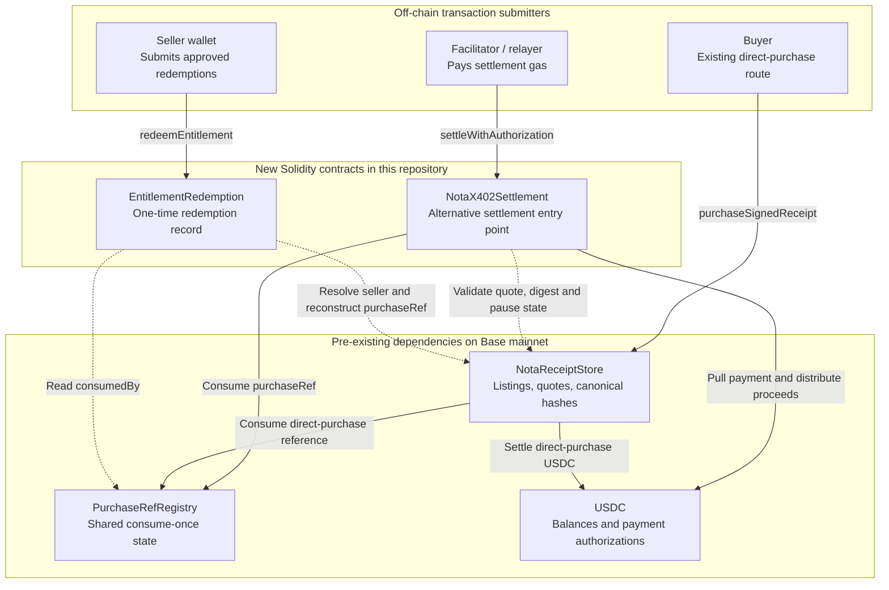
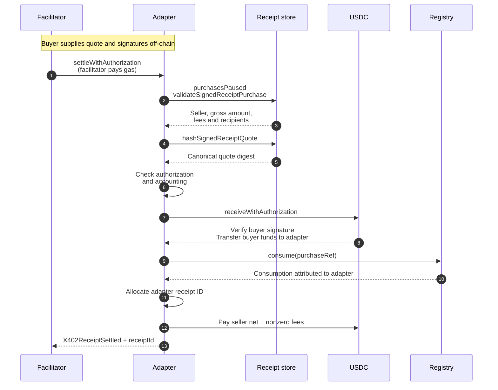
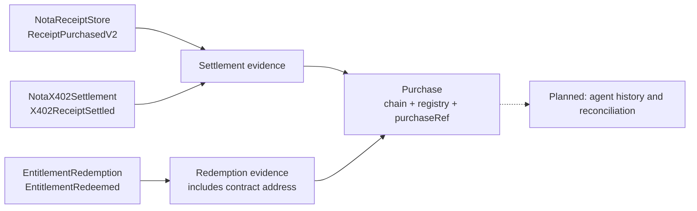

# Nota Entitlements

Nota binds an on-chain payment to what was purchased. This repository adds a way to
pay a Nota quote without the buyer holding ETH, and to redeem the resulting
entitlement once through a seller-authorized transaction.

**On-chain security property:** redemption requires a reference consumed by an accepted
Nota settlement module, can happen once **per redemption deployment**, and must be
submitted by the listing seller. The contract does not authenticate the buyer.

The [redemption endpoint](./packages/resource-server/REDEMPTION.md) enforces the
separate merchant-side policy: the authenticated wallet must equal the settlement
buyer before the seller submits redemption. Current authentication uses genuine
wallet signatures in explicitly labelled mock mode. **World registration and
AgentBook verification are not implemented or verified.**

## Contents

- [Architecture at a glance](#architecture-at-a-glance)
- [Contract responsibilities](#contract-responsibilities)
- [Continuity boundary](#continuity-boundary)
- [Base mainnet dependencies](#base-mainnet-dependencies)
- [x402 settlement adapter](#x402-settlement-adapter)
- [Entitlement redemption](#entitlement-redemption)
- [References, events, and replay protection](#references-events-and-replay-protection)
- [Deployment](#deployment)
- [Backend architecture](#backend-architecture)
- [Public evidence indexing with The Graph](#public-evidence-indexing-with-the-graph)
- [Trust boundaries and limitations](#trust-boundaries-and-limitations)
- [Development](#development)
- [World integration status](#world-integration-status)

## Architecture at a glance

The architecture has three layers: the existing Nota protocol on Base, two new
Solidity contracts that reuse it, and off-chain services that handle quotes,
transaction submission, and buyer authentication.

This is a dependency and call map, not a claim that the new contracts are deployed
on mainnet. The recorded mainnet addresses below belong to the pre-existing baseline.
Solid arrows are state-changing calls; dotted arrows are reads. USDC arrows denote
token-contract calls, not transfers of ETH.



There is deliberately **no adapter-to-redemption call**. Settlement and redemption
are separate transactions, connected by `purchaseRef` and shared registry state.
The adapter does not call the store's purchase function: it calls the store's
validation views, then settles through USDC and the registry itself.

A reference can be paid through either the original store or an accepted adapter,
then redeemed through the same entitlement contract. Redemption neither charges
the buyer again nor consumes the registry reference a second time.

## Contract responsibilities

| Component | Origin | Responsibility | Relevant state / output |
| --- | --- | --- | --- |
| `NotaReceiptStore` | Pre-existing | Resolves listings and sellers, validates quotes, supplies canonical hashes and fee breakdowns; also supports direct purchases | Listings; `ReceiptPurchasedV2` on its own purchase path |
| `PurchaseRefRegistry` | Pre-existing | Allows authorized settlement modules to consume a reference once | `authorizedConsumers`, `isConsumed`, `consumedBy` |
| USDC | Pre-existing | Holds balances and verifies buyer payment authorizations | Balances; token authorization-use state |
| [`NotaX402Settlement`](./src/NotaX402Settlement.sol) | New | Settles a bound quote using EIP-3009, consumes its reference, distributes proceeds | `nextAdapterReceiptId`; `X402ReceiptSettled` |
| [`EntitlementRedemption`](./src/EntitlementRedemption.sol) | New | Checks seller, accepted consumption, and replay; records redemption | Fixed accepted-consumer set; `redeemedAt`; `EntitlementRedeemed` |

Neither new contract is a proxy or an upgrade to the deployed store. Neither has
an owner, an independent pause switch, or upgradeability. Redemption moves no funds;
successful adapter settlements distribute the gross payment within the same
transaction. Tokens accidentally sent to these contracts are not supported deposits
and have no recovery mechanism.

### Minimal interfaces, not copied protocol code

[`src/interfaces/`](./src/interfaces) contains ABI boundaries to the existing
deployments, not vendored Nota implementations:

- `INotaReceiptStore`: listing lookup, canonical reference reconstruction, registry lookup.
- `INotaSignedQuoteStore`: extends that interface with signed-quote validation,
  quote hashing, token lookup, and store configuration views.
- `IPurchaseRefRegistry`: consumption and attribution; owner authorization is exposed
  for deployment tooling and tests, not as an entitlement-contract admin function.
- `IEIP3009`: the token's `receiveWithAuthorization` surface and related views.

Local Solidity mocks are test fixtures only. Production integration targets the
deployed ABI; Base fork tests check compatibility with the real contracts.

## Continuity boundary

The receipt protocol predates ETHOnline 2026. Its baseline is [`notaxyz/contracts@238cb210`](https://github.com/notaxyz/contracts/tree/238cb210e1342892c122b794563b1db99bd4b891), including seller-signed EIP-712 quotes, USDC settlement, `ReceiptPurchasedV2`, and global one-time purchase-reference consumption.

[`BASELINE.md`](./BASELINE.md) records the timestamped boundary, deployed addresses, and the work introduced here. This repository does not vendor or modify Nota's existing contracts.

## Base mainnet dependencies

| Contract | Address |
| --- | --- |
| `NotaReceiptStore` | [`0xf6062F3F52D3E19cb9cc3e027491a5c11D101F88`](https://basescan.org/address/0xf6062F3F52D3E19cb9cc3e027491a5c11D101F88) |
| `PurchaseRefRegistry` | [`0x9AaFfA5787ca332a40B9C98E3e5323A97F96D991`](https://basescan.org/address/0x9AaFfA5787ca332a40B9C98E3e5323A97F96D991) |
| USDC | [`0x833589fCD6eDb6E08f4c7C32D4f71b54bdA02913`](https://basescan.org/address/0x833589fCD6eDb6E08f4c7C32D4f71b54bdA02913) |

Both constructors discover the purchase-reference registry from the receipt store;
the adapter also discovers the settlement token there. Redemption additionally takes
the fixed list of accepted settlement consumers.

Production deployment addresses for the new adapter and redemption contracts are
not recorded in this README. Test fixtures deploy fresh local instances; those
addresses are not mainnet deployment evidence.

## x402 settlement adapter

[`NotaX402Settlement`](./src/NotaX402Settlement.sol) settles a seller-signed Nota quote from a buyer's EIP-3009 `ReceiveWithAuthorization` instead of an `approve` + `transferFrom`. The buyer signs a payment authorization off-chain and never sends a transaction, so a facilitator can submit the settlement and the buyer needs no ETH.

**On-chain security property:** settlement requires both a valid seller-authorized quote and a buyer authorization cryptographically bound to that exact quote, and consumes the quote's purchase reference exactly once.

### Constructor and entry point

```solidity
constructor(address storeAddress)

settleWithAuthorization(
    SignedReceiptQuote quote,
    bytes sellerSignature,
    address claimedSigner,
    ReceiveAuthorization authorization,
    bytes buyerSignature,
    bytes32 paymentSalt
) returns (uint256 receiptId)
```

The constructor keeps `STORE`, `PURCHASE_REF_REGISTRY`, and `SETTLEMENT_TOKEN`
immutable. The seller signs the commercial quote; the buyer signs the token
authorization. Any submitter can relay them. The facilitator pays gas but does not
gain authority to change the purchase. `ReentrancyGuard` and `SafeERC20` protect the
adapter's execution path.

### Settlement call sequence

Here, **Adapter** is `NotaX402Settlement`, **Receipt store** is `NotaReceiptStore`,
and **Registry** is `PurchaseRefRegistry`. The buyer has already checked the quote
and supplied its payment authorization to the facilitator.



All on-chain steps inside the adapter transaction are atomic. If quote validation,
payment, registry consumption, or payout fails, the whole transaction reverts.
Payment is pulled before consumption; consumption happens before distribution.

### Payment authorization and accounting

Matching payer, amount, and adapter alone is insufficient: different sellers'
quotes can share all three. The buyer's authorization nonce therefore commits to
the full quote digest:

```text
quoteDigest = STORE.hashSignedReceiptQuote(quote)
authorization.nonce = keccak256(abi.encode(
    AUTHORIZATION_NONCE_DOMAIN, quoteDigest, paymentSalt
))
```

The adapter re-derives the nonce before spending. The digest includes the seller,
listing, purchase reference, amount, and other signed terms, so an observed payment
authorization cannot be lifted onto another quote for the same price.

It also checks `authorization.from == quote.buyer`, `authorization.to == adapter`,
and `authorization.value == quote.amount`. The store supplies the payout breakdown;
the adapter does not reproduce the fee math. It checks:

```text
quote.amount == grossAmount == protocolFee + integratorFee + sellerNet
```

Successful settlement distributes those amounts. Zero-value fee legs are skipped,
so a zero protocol fee with a zero recipient does not trigger a transfer.

Three other boundaries matter:

- **Bound buyer:** the adapter rejects `quote.buyer == address(0)`, even though the
  store supports optional unbound quotes on its own purchase path.
- **Upstream pause:** it checks `purchasesPaused()` separately because the store's
  validation view does not enforce that switch.
- **Recipient-only execution:** it calls `receiveWithAuthorization`, never
  `transferWithAuthorization`. The token requires `msg.sender == to`, preventing
  an observer from executing the buyer's authorization standalone. The token's
  `bytes` overload supports EOA and ERC-1271 buyer signatures; that does not imply
  smart-wallet support in the mock redemption authorizer.

### Adapter receipt ids are not store receipt ids

`X402ReceiptSettled.receiptId` comes from `nextAdapterReceiptId`, a counter local to this contract. It is unrelated to `NotaReceiptStore.nextReceiptId`, and a settlement through the adapter does not advance the store's counter. Adapter receipt `7` and store receipt `7` are different records in different id spaces. The only identifier that joins the two systems is `purchaseRef`; index on that, never on the id.

The adapter also does not emit `ReceiptPurchasedV2`. That event belongs to the store and cannot be emitted from here, which is why `X402ReceiptSettled` carries `listingId` itself — `purchaseRef` does not commit to a listing, so without it a settlement could not be attributed to one from its own event.

That is a deliberate asymmetry with `EntitlementRedeemed`, which omits the listing id. The difference is what a signature covers: `listingId` is inside the seller-signed quote, so the adapter emits an attested fact, whereas redemption has no signature over a listing id and a seller could emit any listing they liked. Same field, opposite correct answer — neither event should be changed to match the other.

## Entitlement redemption

### Constructor, state, and checks

```solidity
constructor(address storeAddress, address[] additionalConsumers)

redeemEntitlement(
    uint256 listingId,
    string rawPurchaseRef,
    bytes32 purchaseRefNonce
) returns (bytes32 purchaseRef)
```

The constructor discovers the registry from the store. It accepts the store itself
plus the explicitly supplied settlement modules. Zero and duplicate consumers are
rejected. The set is fixed for that deployment and can be inspected through
`acceptedConsumers()` and `isAcceptedConsumer(address)`.

At redemption, the contract:

1. Resolves the seller through `STORE.getListing(listingId)`. A nonexistent listing
   reverts in the store with `ListingNotFound()`.
2. Requires `msg.sender` to be that seller.
3. Calls `STORE.hashPurchaseRef(seller, listingId, rawPurchaseRef, purchaseRefNonce)`.
   It does not implement its own version of the reference hash.
4. Requires the registry's `consumedBy(purchaseRef)` to be an accepted consumer.
   Unconsumed references return the zero address, which is never accepted.
5. Requires `redeemedAt[purchaseRef] == 0`, writes a `uint64` timestamp, and emits
   `EntitlementRedeemed`.

The contract does **not** know the buyer's identity. It does not read receipt logs,
call AgentKit, or determine whether off-chain content was delivered.

### Backend policy and contract execution

Payment proof and requester identity are separate checks. The endpoint verifies
both before it lets the seller wallet call the contract. In the diagram,
**Redemption** is `EntitlementRedemption`, **Authorizer** is the `AgentAuthorizer`
interface, and **Base data** groups transaction receipts, the store, and the registry.

```mermaid
sequenceDiagram
    participant A as Agent
    participant API as Endpoint
    participant AUTH as Authorizer
    participant BASE as Base data
    participant E as Redemption

    Note over A,AUTH: Current authorizer: signed-wallet mock, not World ID
    A->>API: POST /v1/redemptions<br/>Proof, bundle, purchaseTxHash
    API->>AUTH: 1. authorize(request)
    AUTH-->>API: Verified wallet address<br/>Synthetic mock humanId
    API->>BASE: 2. Confirm purchase tx<br/>and trusted receipt event
    API->>BASE: 3. Reconstruct reference<br/>Match receipt, listing, seller
    API->>BASE: 4. Check consumption<br/>by receipt emitter
    API->>E: 5. Read redeemedAt
    alt Already redeemed
        API-->>A: 409 ALREADY_REDEEMED<br/>No transaction
    else Not redeemed
        API->>API: 6. Agent wallet<br/>equals receipt buyer?
        alt Different wallet
            API-->>A: 403 BUYER_MISMATCH<br/>No transaction
        else Same wallet
            API->>E: 7. Simulate then submit<br/>redeemEntitlement as seller
            E->>BASE: Read seller, reference,<br/>and consumedBy
            E->>E: Check caller + replay<br/>Write redeemedAt
            E-->>API: EntitlementRedeemed
            API-->>A: 201 after confirmation<br/>and event verification
        end
    end
```



Every failed prerequisite stops the flow. The diagram shows replay and wrong-agent
branches explicitly because those are the demo's two distinct rejection cases.
The contract repeats its own checks; backend validation does not replace them.
Contract-to-store/registry calls execute on-chain, while the endpoint's reads use
its configured Base RPC.

The endpoint accepts `{ listingId, purchaseTxHash, rawPurchaseRef, purchaseRefNonce }`.
It recognizes either `ReceiptPurchasedV2` from the configured store or
`X402ReceiptSettled` from a trusted adapter. An adapter transaction does not need
to contain the store event as well. The registry consumer must match the actual
settlement emitter—not merely some other accepted module.

Before checking consumption, the endpoint also loads the merchant's issued order
by `purchaseRef` and compares the receipt's amount, metadata commitment, listing,
and buyer with that order. An unknown order or a mismatch is rejected at step 3;
the request cannot supply its own expected amount or metadata.

The current [`AgentAuthorizer`](./packages/resource-server/src/redemption/authorizer.ts)
implementation verifies a single-use EOA signature over the exact request digest,
endpoint, chain, contract, wallet, and expiry. A future World implementation must
add AgentKit verification and AgentBook resolution. See the existing [endpoint
runbook](./packages/resource-server/REDEMPTION.md) for headers and response codes.

## References, events, and replay protection

An entitlement here is a reference plus registry/redemption state—not a newly minted
NFT or transferable token. The purchase-reference preimage includes the seller, so
redemption uses a single `mapping(bytes32 => uint64)`, not per-seller nested mappings.

### One join key, separate receipt ID spaces

| Event | Emitter | What it records | Listing attribution |
| --- | --- | --- | --- |
| `ReceiptPurchasedV2` | Existing store | A direct Nota purchase | Carries `listingId` |
| `X402ReceiptSettled` | New adapter | An adapter-settled purchase | Carries the signed quote's `listingId` |
| `EntitlementRedeemed` | New redemption contract | Seller-authorized use of `purchaseRef` at a timestamp | Omits `listingId`; join to the purchase event |

Use **`purchaseRef`** to join a redemption to its purchase, not `receiptId`.
`hashPurchaseRef` takes a `listingId` to validate the seller, but that ID is **not
committed into the reference hash**. The seller-signed quote does commit to a listing.
The backend therefore checks the requested listing against the authoritative
settlement event separately.

### Two different one-time-use checks

| Stage | State checked | Meaning |
| --- | --- | --- |
| Before settlement | Registry reference unconsumed | Available to be settled |
| After settlement | `consumedBy` identifies the store or adapter; `redeemedAt == 0` | Paid through that module, not redeemed here |
| After redemption | Registry consumption unchanged; `redeemedAt > 0` | Redeemed on this entitlement deployment |

Registry consumption prevents duplicate settlement across its consumers. The
redemption mapping prevents duplicate redemption **within one deployment**. Deploying
a new redemption contract starts with empty state and does not automatically preserve
the old contract's replay protection.

### Keep the three nonce-like values separate

| Value | Purpose | Visibility |
| --- | --- | --- |
| `purchaseRefNonce` | Cryptographic secrecy for the redemption preimage bundle | Private before redemption; published in redemption calldata |
| `paymentSalt` | Fresh entropy for a quote-bound payment authorization | Public settlement calldata |
| `authorization.nonce` | Token-level replay protection, bound to the signed quote | Public settlement calldata and adapter event |

`rawPurchaseRef` is a string and is not necessarily secret. Together with
`purchaseRefNonce`, it forms the **redemption preimage bundle**. Neither payment nonce
nor payment salt may be derived from that bundle. Application logs must never contain
the bundle; sending it to a redemption RPC and publishing redemption calldata are
separate, intentional disclosures—not long-term secret storage.

## Deployment

The order and the two separate permission checks matter:

1. Deploy `NotaX402Settlement(storeAddress)`.
2. Have the existing registry owner authorize that adapter to consume references.
3. Deploy `EntitlementRedemption(storeAddress, [adapter])`; the store is included automatically.
4. Configure the backend with that redemption address, trusted adapter emitters,
   Base RPC, and dedicated seller key. Startup checks deployment wiring.

### Operator commands

These are operator instructions, not actions performed by the local demo. Configure
an appropriately authorized signer: `--broadcast` sends real transactions on the
selected network and spends gas. Never put private keys in command history.

```sh
forge script script/DeployNotaX402Settlement.s.sol --rpc-url "$BASE_RPC_URL" --broadcast

# Run separately with the existing registry owner's signer configuration:
cast send --rpc-url "$BASE_RPC_URL" 0x9AaFfA5787ca332a40B9C98E3e5323A97F96D991 \
  "setConsumerAuthorization(address,bool)" <adapter-address> true

# Then deploy redemption with that adapter accepted:
ENTITLEMENT_ACCEPTED_CONSUMERS=<adapter-address> \
  forge script script/DeployEntitlementRedemption.s.sol --rpc-url "$BASE_RPC_URL" --broadcast
```

The [adapter deployment script](./script/DeployNotaX402Settlement.s.sol) prints the
required registry-owner action. The [redemption deployment script](./script/DeployEntitlementRedemption.s.sol)
prints the fixed accepted-consumer set and warns when no adapters are supplied.

Without registry authorization, adapter settlement reverts with `UnauthorizedConsumer`.
Without inclusion in the redemption deployment, references consumed by that adapter
fail there with `EntitlementNotPaid`. Neither omission is fixed by changing a backend
environment variable. Adding a consumer later requires a new redemption deployment
and a plan for already-redeemed references.

## Backend architecture

| Module | Role | Relevant boundary |
| --- | --- | --- |
| [`packages/x402-nota`](./packages/x402-nota/src) | Shared ABIs, quote types, metadata hashing, nonce derivation, trust configuration | Typed integration with the configured Nota deployment |
| [`packages/client`](./packages/client/src) | Checks purchase terms and deployment configuration, signs payment, retrieves paid content | Does not trust contract addresses merely because a 402 response names them |
| [`packages/resource-server`](./packages/resource-server/src/index.ts) | Issues buyer-bound quotes; releases paid content/bundle after buyer authentication | A public purchase reference is not authentication |
| [`packages/facilitator`](./packages/facilitator/src) | Submits allowed adapter settlements and pays gas | Relayer key is not the buyer's key or redemption authority |
| [`resource-server/src/redemption`](./packages/resource-server/src/redemption) | Separate redemption HTTP service, authorizer seam, chain verification, seller writer | Enforces authenticated-wallet == receipt-buyer before seller submission |

The client and connected demo generate a fresh preimage bundle **on the buyer side
before requesting a quote**. They POST it to the report URL with `X-PAYER`; the
merchant uses the deployed store's canonical hash helper, persists the order, and
returns a buyer-bound HTTP 402 quote without the bundle. Before authorizing payment,
the client independently calls the trusted store's helper and rejects a quote that
does not commit to its original bundle. Legacy GET checkout remains available with
merchant-generated bundles; the client does not silently fall back to it.

Buyer-generated does **not** mean buyer-exclusive: the merchant receives and stores
the bundle, and the configured RPC receives it when computing the canonical hash.
Use trusted endpoints, HTTPS, private order storage, and disable request-body logging
at reverse proxies/APM as well as in the application. The client refuses non-HTTPS
checkout URLs except loopback development and refuses checkout redirects. Public
payment messages still carry only the commitment; redemption later publishes the
bundle in transaction calldata.

`AgentConfig.onBundleCreated` is an optional asynchronous hook for privately retaining
the buyer's copy before checkout. A failed hook aborts before any request or payment.
Without it, that copy is in memory until `payAndFetch` returns it; the connected demo
uses in-memory retention, not a durable buyer wallet vault. Authenticated paid access
can still recover the merchant-held copy after a merchant restart. Buyer binding is
to the wallet signing payment; World registration remains a separate pending check.

### Persistent issued orders

Both server entry points require **`QUOTE_STORE_PATH`**, set to the same absolute
path on persistent storage (for example, an `issued-orders.json` file in a private
directory). The resource server saves each order **before returning its signed
quote**. Restarting the service preserves the order and its bundle; outstanding
authentication challenges still expire or are lost on restart.

The file store serializes writes within one process and atomically replaces the
file, with owner-only file permissions. Failed writes are not published as saved
orders. Redemption reads the file afresh, so a separately running service sees new
orders without a restart. Missing orders fail closed; corrupt or unreadable storage
produces a sanitized error, not an automatic memory fallback.

Run **one resource-server writer per order file**. Multiple writer processes or
hosts need a database or cross-process coordination, which this file store does not
provide. Keep a separate file per merchant/deployment, protect and back it up as
secret material, and do not commit it: it contains redemption preimage bundles.
Memory stores remain available for isolated tests; the server commands never default
to them. The connected Base-fork demo below uses this file-backed path for both services.

The wire scheme is **`nota-exact`**, not generic x402 `exact`. This is a Nota-aware
settlement path with an adapter allowlist, not a generalized facilitator. On-chain
Nota receipts are also distinct from off-chain signed offers/delivery attestations;
the repository does not implement or claim tested interoperability with x402's
optional Signed Offers & Receipts extension. See [packages/README.md](./packages/README.md)
for the paid-resource protocol.

## Public evidence indexing with The Graph

[`packages/subgraph`](./packages/subgraph) contains the schema, event mappings, and
deterministic tests for a read-only index of Nota purchase and redemption evidence.
**Status: mappings built/tested; live-indexing preflight prepared. No subgraph has
been published, no live indexing has been verified, and the backend does not query it yet.** World
authentication remains a separate, pending integration.



The mappings cover the three event types, not every event or every state variable
in the contracts. They never submit transactions or change the settlement and
redemption rules.

| Entity | Identity / meaning |
| --- | --- |
| `Purchase` | `chainId:registry:purchaseRef` joins settlement and redemption evidence; receipt IDs are not join keys |
| `Settlement` | `chainId:transactionHash:logIndex` preserves the emitter, receipt ID, buyer, seller, listing, amount, metadata hash, agent ID, and block provenance |
| `Redemption` | Independent event evidence including `redemptionContract`; there is deliberately no global `Purchase.redeemed` flag |
| `Listing` | `chainId:store:listingId` groups observed settlement references, not a complete catalog or current listing state |

Duplicate processing of the same log is idempotent. Distinct settlement logs claiming
the same reference are retained and marked `CONFLICTED`; later claims do not silently
replace the first buyer or purchase terms. A redemption without indexed purchase
history creates an `UNKNOWN` purchase, not a fabricated receipt. `SETTLED` means an
event was indexed, **not** that the current endpoint authorizes redemption.

The manifest pins the existing Base store address and verified creation block
`50,536,305` (deployment evidence below). Adapter and redemption mappings are currently uninstantiated
templates: they compile and are tested, but index nothing until reviewed public
deployment addresses, start blocks, and store/registry context are configured.
A hosted subgraph cannot observe contracts deployed only on the local demo fork.

Only public event fields are indexed. The schema contains neither `rawPurchaseRef`
nor `purchaseRefNonce`, and mappings do not inspect redemption calldata. The public
EIP-3009 `authorizationNonce` is a different value, not the private preimage nonce.
A metadata hash proves a commitment, not access to the underlying document or
proof of fulfillment. An event's `agentId` is not human-verification evidence.

Future queries can support purchase history, spending summaries, and candidate
unredeemed purchases **for a selected redemption deployment**. Before acting, the
backend must still check authoritative RPC state, accepted consumers, expected order
terms, and buyer authentication. Missing data, indexing lag/errors, conflicting
claims, or uncertain finality mean **unknown**, not permission to redeem. Live
validation must include indexer health, block freshness, and pagination. Gas and
query infrastructure can incur costs; this adds no new protocol fee and makes no
free-query or free-gas claim.

### Build and test the index

Use Node.js **22** (minimum 20.19), then run from the repository root:

```sh
npm ci
npm run subgraph:build
npm run subgraph:test
```

The build generates types and compiles all three mappings to WASM. Matchstick 0.6.0
executes deterministic tests of the actual AssemblyScript handlers without Base RPC
or Graph credentials. Its first run downloads the platform-specific test runner;
CI uses Ubuntu 22.04 for that binary. ABI parity tests also run with `npm test`.
Generated code, compiled artifacts, and downloaded runners are ignored by Git.

Tooling caveat: `npm audit` currently reports advisories in Graph CLI transitive
development dependencies, including a critical `decompress` archive-extraction
advisory. A successful build does not resolve those findings. Do not use this
toolchain to process untrusted archives or expose its development services; review
the dependency findings before deployment tooling is approved. Existing application
dependency versions are unchanged by this index implementation.

### Live-indexing preparation and verification

The existing store's [creation transaction](https://basescan.org/tx/0x78301d0cffc614a1ad591275a96fbdd413fddb73568d57fe6bda3a37e4055266)
succeeded on Base at block `50,536,305`, with the expected contract address. Its
creation was located through Blockscout and checked against Base RPC. The read-only
preflight rechecks that evidence, the chain ID and registry wiring, and the actual
`ReceiptPurchasedV2` log for [receipt #1](https://basescan.org/tx/0x3b9656b4a67dee38ca2bd28d8841fbb67469c0ed3f9ace2977e5b753e7230978)
at block `50,833,757`, log index `474`. This is **pre-existing receipt evidence**,
not a new purchase or World-registration demonstration. No preimage bundle is needed.

```sh
# RPC-only preparation: no Graph account, keys, publication, or transactions.
BASE_RPC_URL=https://your-base-rpc npm run subgraph:preflight

# After approved deployment: use the query URL and exact deployment CID from Studio.
BASE_RPC_URL=https://your-base-rpc \
GRAPH_QUERY_URL=https://your-subgraph-query-endpoint \
GRAPH_DEPLOYMENT_ID=your-deployment-cid \
npm run subgraph:preflight
```

Without `GRAPH_QUERY_URL`, the command reports `RPC_EVIDENCE_VERIFIED_ONLY` with
`graphVerified: false`. With it, the command requires the expected deployment CID,
healthy index metadata and no more than 300 blocks of lag relative to RPC. It
cross-checks the indexed block hash against RPC, selects an indexed, finalized
snapshot, and paginates settlements at that fixed block hash using increasing IDs.
Missing metadata, GraphQL errors (even with partial data), a changed deployment or
snapshot, invalid cursors, and exhausted page limits all fail the check. The cap is
100 pages of 100 rows; a larger index requires an explicitly reviewed cap change,
not a partial-success claim. Endpoint URLs and provider error details are not logged.

Success compares receipt #1's public fields and log/block provenance against RPC
and reports `INDEX_COMPATIBILITY_VERIFIED`. This is a compatibility check for that
receipt plus source/pagination checks across the returned store settlements—not an
independent audit of every indexed receipt and never permission to redeem. The
actual Graph endpoint path remains unverified until a deployment is available;
deterministic tests exercise its failure cases without credentials.

Next approval gate: review this preparation, resolve the deployment-tool dependency
findings, select/create the Studio subgraph, and authorize deployment. Keep deployment
keys local; do not commit or paste them into documentation. Publishing a subgraph to
the decentralized network and any associated on-chain spending require their own
approval. Agent reconciliation follows live receipt validation; a public indexed
purchase-to-redemption demo additionally requires approved public deployments of
the new contracts. World registration can progress independently throughout.

Implementation references: [Graph manifests](https://thegraph.com/docs/en/subgraphs/developing/creating/subgraph-manifest/),
[GraphQL schemas](https://thegraph.com/docs/en/subgraphs/developing/creating/ql-schema/),
and [Matchstick testing](https://thegraph.com/docs/en/subgraphs/tooling/unit-testing-framework/).
The preflight follows the documented [GraphQL metadata, historical queries, and cursor pagination](https://thegraph.com/docs/en/subgraphs/querying/graphql-api/).

## Trust boundaries and limitations

- **Registry authorization and redemption acceptance are different gates.** The
  registry owner authorizes an adapter to consume new references. The redemption
  constructor fixes which consumers count as payment. The backend additionally
  pins which event emitters it trusts.
- **No new admin does not mean no upstream controls.** Store pause state can stop
  new adapter purchases; the registry owner can revoke adapter consumption.
  These do not erase prior consumption or redemption records.
- **The seller remains trusted for redemption policy.** A seller can bypass the
  endpoint and call the contract directly. The contract does not enforce buyer
  binding, World verification, or off-chain fulfillment.
- **Redeployment changes the replay domain.** A new accepted-consumer list requires
  a new redemption deployment with empty redemption state. Migration must account
  for entitlements already redeemed against older addresses.
- **The current backend is a development milestone.** Mock mode requires explicit
  opt-in and refuses `NODE_ENV=production`. It supports EOA authentication only,
  uses in-memory challenges and a single-process seller queue, and needs durable
  coordination and abuse controls before production operation.
- **Fail closed on uncertain submission.** A lost broadcast/confirmation response
  blocks further seller submissions until reconciled. Do not restart and retry
  blindly. RPC trust, confirmation policy, and reorg risk still apply.
- **Do not overclaim identity.** Mock signatures prove wallet control, not a verified
  or unique human. World status is tracked separately below.

See [SECURITY.md](./SECURITY.md) for detailed assumptions, logging restrictions,
upstream dependencies, and non-guarantees.

## Development

### Connected purchase-to-redemption demo

With Node.js 22 (minimum 20.19), Foundry/Anvil (CI pins 1.8.1), initialized submodules, and `npm ci`:

```sh
BASE_RPC_URL=https://your-base-mainnet-rpc npm run demo:connected
```

The command starts a **disposable local Base fork** and uses the real deployed
Nota store, registry, and USDC code/state as its starting point. It builds and deploys
the unchanged adapter and redemption contracts locally, authorizes the adapter by
impersonating the registry owner **on the fork only**, and starts the resource,
facilitator, and mock-authenticated redemption HTTP services. The buyer is funded
with fork USDC and no ETH. No wallet keys or pre-existing receipt bundle are needed.

It exercises one purchase end to end:

1. Buyer A generates its bundle, POSTs it privately, receives HTTP 402 with a buyer-bound quote, and verifies its bundle commitment and purchase terms.
2. A signs the EIP-3009 authorization; the facilitator submits settlement and pays gas.
3. A signs an access challenge and receives the resource; the client retains A's original bundle.
4. The resource server restarts; A recovers the same purchase without paying again.
5. B presents A's exact bundle before redemption: `403 BUYER_MISMATCH`, step 6, no transaction.
6. A uses that bundle: `201`, with the actual `EntitlementRedeemed` event verified.
7. A retries: `409 ALREADY_REDEEMED`, step 5, no second redemption transaction.

The runner asserts one quote, one settlement, the same `purchaseRef` throughout,
USDC movement, and an unchanged buyer transaction count and zero ETH balance.
It checks anonymous access is denied and that the bundle is absent from the 402,
settlement request, demo transcript, and redemption audit logs. The transcript prints
only selected public fields; errors do not dump response bodies or RPC calldata.

**Limits:** requester authentication is still `mock-wallet`, with `humanVerified: false`.
The bundle is freshly **buyer-generated**, shared with the merchant through checkout,
and kept in memory by the demo buyer. Real World authentication remains unfinished.
All printed transaction hashes belong to the local fork, not a public deployment.
Services, fork state, and the temporary issued-order file are disposed after the run.
This command requires a working Base RPC and fails rather than silently switching to mocks.

The same runner is exercised by `packages/e2e/test/connected-flow.test.ts`. That
integration test skips without `BASE_RPC_URL`; deterministic backend and local-EVM
tests continue to run without an external RPC. Scripts do not automatically load `.env`.

### Redemption backend demo

With Node.js 20+, Foundry/Anvil, and initialized submodules:

```sh
git submodule update --init --recursive
npm ci
npm run demo:redemption
```

This starts a fresh local Anvil chain, builds and deploys the unchanged adapter and
redemption contracts with existing mock Nota/token dependencies, and makes a new
buyer-bound purchase using a buyer-generated preimage bundle. It proves:

- Agent B with agent A's bundle: `403 BUYER_MISMATCH`, step 6, no transaction.
- Agent A with the correct bundle: confirmed `EntitlementRedeemed` event.
- Agent A again with a fresh signed challenge: `409 ALREADY_REDEEMED`, step 5, no transaction.

The attacker runs first so the rejection demonstrates buyer binding, not replay
protection. This is a local wallet-authentication demo, **not** a Base-mainnet purchase
or a World-verified agent demo. The mock store does not validate seller signatures;
deployed-store compatibility remains covered separately by the Base fork suites.
`npm test` always runs the new HTTP/signature and local-EVM suites without an external
RPC; missing Foundry is a failure, never a silent skip.

See the [endpoint runbook](./packages/resource-server/REDEMPTION.md) for configuration,
request signing, trust boundaries, and deployment limitations.

### Contracts

The project uses Foundry and Solidity 0.8.24. Clone with submodules; the adapter uses OpenZeppelin's `SafeERC20` and `ReentrancyGuard`.

```sh
git submodule update --init --recursive
```

```sh
forge build
forge test
```

### Verification layers

| Suite | What it proves | External RPC? |
| --- | --- | --- |
| Solidity deterministic tests | Contract guards, authorization binding, fee accounting, events, and replay | No |
| TypeScript unit / HTTP tests | Signed challenges, ordered policy checks, event decoding, concurrency, log redaction | No |
| TypeScript local Anvil tests | Real adapter/redemption transactions, no transactions on policy rejection, uncertain-broadcast handling | No; starts its own Anvil |
| Base fork suites | Compatibility with the deployed store, registry, and USDC, including signature/domain validation | Yes; skip without `BASE_RPC_URL` |

```sh
forge fmt --check
npm run typecheck
npm test
# Include TypeScript Base compatibility tests:
BASE_RPC_URL=https://your-base-mainnet-rpc npm test
```

The mock store does not verify seller signatures—it exposes the validation result
as a test control. Deployed-store compatibility is a fork-suite concern. The fork
tests exercise the real store's seller-signature validation, deployed USDC's
EIP-3009 authorization checks, registry-owner adapter authorization, and the path
from adapter settlement to redemption. Domain separators are checked against the
deployed contracts rather than inferred from the mocks.

```sh
BASE_RPC_URL=https://your-base-mainnet-rpc forge test
```

CI pins Foundry to the version in [.github/workflows/test.yml](./.github/workflows/test.yml)
(currently 1.8.1). Match that version locally; formatter output differs between versions.

Receipt #1 supplies the consumed reference used for deployed-contract compatibility testing without committing its redemption preimage bundle:

```text
listing:      1
purchaseRef:  0x5333d780992fdf98c143083b765392aeaa27cb393a034235026f57f202806770
```

Copy `.env.example` to `.env` or export these variables in your shell:

```sh
BASE_RPC_URL=https://your-base-mainnet-rpc
RECEIPT_1_RAW_PURCHASE_REF=your-raw-reference
RECEIPT_1_PURCHASE_REF_NONCE=0x...
```

Bundle-dependent integration tests skip when either receipt variable is absent. The remaining fork tests still exercise caller authorization, unpaid references, and nonexistent listings against the live deployment.

Never commit `.env`, a redemption preimage bundle, `out/`, or `cache/`.
The TypeScript scripts do not automatically load `.env`; export their configuration
securely as described in the existing [redemption runbook](./packages/resource-server/REDEMPTION.md).

## World integration status

`AgentAuthorizer` is the integration seam. `MockAgentAuthorizer` is implemented and
tested. `WorldAgentKitAuthorizer`, AgentBook lookup, and registered buyer/attacker
agents remain pending. The mock's `humanId` is synthetic, and responses identify
`authentication: "mock-wallet"` with `humanVerified: false`.

[WORLD_FEEDBACK.md](./WORLD_FEEDBACK.md) records registration friction, the documentation
disagreement about registry/network defaults, and the draft questions for World.
It is not evidence that a message was sent or that registration succeeded.

The connected demo now uses a new buyer-generated preimage bundle and binds the quote
to buyer A's signing wallet. The final World demonstration must additionally authenticate
that wallet through AgentKit and exercise real registered agents. Receipt #1 and the local mock demo establish different things and cannot
substitute for that verification. No automatic World-to-mock downgrade is implemented.

## License

Apache-2.0
