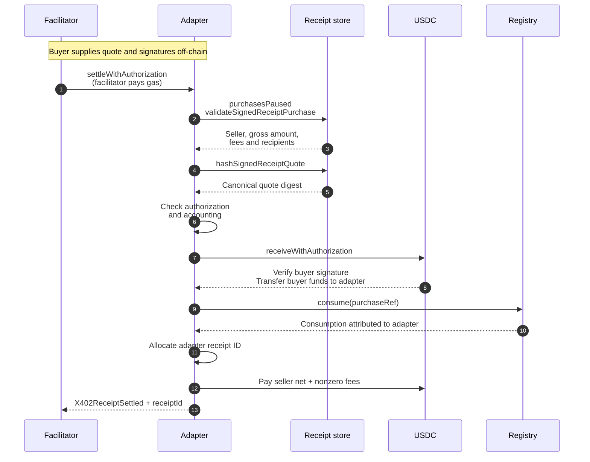
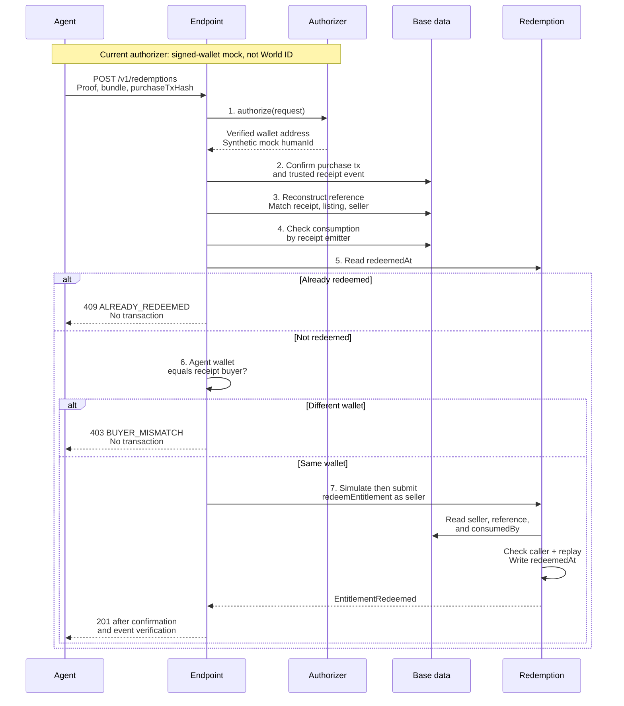

# Contract and enforcement reference

[Overview and dependency diagram](../README.md#architecture-at-a-glance) · [Security model](../SECURITY.md)

## x402 settlement adapter

[`NotaX402Settlement`](../src/NotaX402Settlement.sol) settles a seller-signed Nota quote from a buyer's EIP-3009 `ReceiveWithAuthorization` instead of an `approve` + `transferFrom`. The buyer signs a payment authorization off-chain and never sends a transaction, so a facilitator can submit the settlement and the buyer needs no ETH.

**On-chain security property:** settlement requires both a valid seller-authorized quote and a buyer authorization cryptographically bound to that exact quote, and consumes the quote's purchase reference exactly once.

### Constructor and entry point

```solidity
constructor(address storeAddress)

settleWithAuthorization(
    SignedReceiptQuote quote,
    bytes sellerSignature,
    address claimedSigner,
    ReceiveAuthorization authorization,
    bytes buyerSignature,
    bytes32 paymentSalt
) returns (uint256 receiptId)
```

The constructor keeps `STORE`, `PURCHASE_REF_REGISTRY`, and `SETTLEMENT_TOKEN`
immutable. The seller signs the commercial quote; the buyer signs the token
authorization. Any submitter can relay them. The facilitator pays gas but does not
gain authority to change the purchase. `ReentrancyGuard` and `SafeERC20` protect the
adapter's execution path.

### Settlement call sequence

Here, **Adapter** is `NotaX402Settlement`, **Receipt store** is `NotaReceiptStore`,
and **Registry** is `PurchaseRefRegistry`. The buyer has already checked the quote
and supplied its payment authorization to the facilitator.



All on-chain steps inside the adapter transaction are atomic. If quote validation,
payment, registry consumption, or payout fails, the whole transaction reverts.
Payment is pulled before consumption; consumption happens before distribution.

### Payment authorization and accounting

Matching payer, amount, and adapter alone is insufficient: different sellers'
quotes can share all three. The buyer's authorization nonce therefore commits to
the full quote digest:

```text
quoteDigest = STORE.hashSignedReceiptQuote(quote)
authorization.nonce = keccak256(abi.encode(
    AUTHORIZATION_NONCE_DOMAIN, quoteDigest, paymentSalt
))
```

The adapter re-derives the nonce before spending. The digest includes the seller,
listing, purchase reference, amount, and other signed terms, so an observed payment
authorization cannot be lifted onto another quote for the same price.

It also checks `authorization.from == quote.buyer`, `authorization.to == adapter`,
and `authorization.value == quote.amount`. The store supplies the payout breakdown;
the adapter does not reproduce the fee math. It checks:

```text
quote.amount == grossAmount == protocolFee + integratorFee + sellerNet
```

Successful settlement distributes those amounts. Zero-value fee legs are skipped,
so a zero protocol fee with a zero recipient does not trigger a transfer.

Three other boundaries matter:

- **Bound buyer:** the adapter rejects `quote.buyer == address(0)`, even though the
  store supports optional unbound quotes on its own purchase path.
- **Upstream pause:** it checks `purchasesPaused()` separately because the store's
  validation view does not enforce that switch.
- **Recipient-only execution:** it calls `receiveWithAuthorization`, never
  `transferWithAuthorization`. The token requires `msg.sender == to`, preventing
  an observer from executing the buyer's authorization standalone. The token's
  `bytes` overload supports EOA and ERC-1271 buyer signatures; that does not imply
  smart-wallet support in the mock redemption authorizer.

### Adapter receipt ids are not store receipt ids

`X402ReceiptSettled.receiptId` comes from `nextAdapterReceiptId`, a counter local to this contract. It is unrelated to `NotaReceiptStore.nextReceiptId`, and a settlement through the adapter does not advance the store's counter. Adapter receipt `7` and store receipt `7` are different records in different id spaces. The only identifier that joins the two systems is `purchaseRef`; index on that, never on the id.

The adapter also does not emit `ReceiptPurchasedV2`. That event belongs to the store and cannot be emitted from here, which is why `X402ReceiptSettled` carries `listingId` itself — `purchaseRef` does not commit to a listing, so without it a settlement could not be attributed to one from its own event.

That is a deliberate asymmetry with `EntitlementRedeemed`, which omits the listing id. The difference is what a signature covers: `listingId` is inside the seller-signed quote, so the adapter emits an attested fact, whereas redemption has no signature over a listing id and a seller could emit any listing they liked. Same field, opposite correct answer — neither event should be changed to match the other.

## Entitlement redemption

### Constructor, state, and checks

```solidity
constructor(address storeAddress, address[] additionalConsumers)

redeemEntitlement(
    uint256 listingId,
    string rawPurchaseRef,
    bytes32 purchaseRefNonce
) returns (bytes32 purchaseRef)
```

The constructor discovers the registry from the store. It accepts the store itself
plus the explicitly supplied settlement modules. Zero and duplicate consumers are
rejected. The set is fixed for that deployment and can be inspected through
`acceptedConsumers()` and `isAcceptedConsumer(address)`.

At redemption, the contract:

1. Resolves the seller through `STORE.getListing(listingId)`. A nonexistent listing
   reverts in the store with `ListingNotFound()`.
2. Requires `msg.sender` to be that seller.
3. Calls `STORE.hashPurchaseRef(seller, listingId, rawPurchaseRef, purchaseRefNonce)`.
   It does not implement its own version of the reference hash.
4. Requires the registry's `consumedBy(purchaseRef)` to be an accepted consumer.
   Unconsumed references return the zero address, which is never accepted.
5. Requires `redeemedAt[purchaseRef] == 0`, writes a `uint64` timestamp, and emits
   `EntitlementRedeemed`.

The contract does **not** know the buyer's identity. It does not read receipt logs,
call AgentKit, or determine whether off-chain content was delivered.

### Backend policy and contract execution

Payment proof and requester identity are separate checks. The endpoint verifies
both before it lets the seller wallet call the contract. In the diagram,
**Redemption** is `EntitlementRedemption`, **Authorizer** is the `AgentAuthorizer`
interface, and **Base data** groups transaction receipts, the store, and the registry.



Every failed prerequisite stops the flow. The diagram shows replay and wrong-agent
branches explicitly because those are the demo's two distinct rejection cases.
The contract repeats its own checks; backend validation does not replace them.
Contract-to-store/registry calls execute on-chain, while the endpoint's reads use
its configured Base RPC.

The endpoint accepts `{ listingId, purchaseTxHash, rawPurchaseRef, purchaseRefNonce }`.
It recognizes either `ReceiptPurchasedV2` from the configured store or
`X402ReceiptSettled` from a trusted adapter. An adapter transaction does not need
to contain the store event as well. The registry consumer must match the actual
settlement emitter—not merely some other accepted module.

Before checking consumption, the endpoint also loads the merchant's issued order
by `purchaseRef` and compares the receipt's amount, metadata commitment, listing,
and buyer with that order. An unknown order or a mismatch is rejected at step 3;
the request cannot supply its own expected amount or metadata.

The current [`AgentAuthorizer`](../packages/resource-server/src/redemption/authorizer.ts)
implementation verifies a single-use EOA signature over the exact request digest,
endpoint, chain, contract, wallet, and expiry. A future World implementation must
add AgentKit verification and AgentBook resolution. See the existing [endpoint
runbook](../packages/resource-server/REDEMPTION.md) for headers and response codes.

## References, events, and replay protection

An entitlement here is a reference plus registry/redemption state—not a newly minted
NFT or transferable token. The purchase-reference preimage includes the seller, so
redemption uses a single `mapping(bytes32 => uint64)`, not per-seller nested mappings.

### One join key, separate receipt ID spaces

| Event | Emitter | What it records | Listing attribution |
| --- | --- | --- | --- |
| `ReceiptPurchasedV2` | Existing store | A direct Nota purchase | Carries `listingId` |
| `X402ReceiptSettled` | New adapter | An adapter-settled purchase | Carries the signed quote's `listingId` |
| `EntitlementRedeemed` | New redemption contract | Seller-authorized use of `purchaseRef` at a timestamp | Omits `listingId`; join to the purchase event |

Use **`purchaseRef`** to join a redemption to its purchase, not `receiptId`.
`hashPurchaseRef` takes a `listingId` to validate the seller, but that ID is **not
committed into the reference hash**. The seller-signed quote does commit to a listing.
The backend therefore checks the requested listing against the authoritative
settlement event separately.

### Two different one-time-use checks

| Stage | State checked | Meaning |
| --- | --- | --- |
| Before settlement | Registry reference unconsumed | Available to be settled |
| After settlement | `consumedBy` identifies the store or adapter; `redeemedAt == 0` | Paid through that module, not redeemed here |
| After redemption | Registry consumption unchanged; `redeemedAt > 0` | Redeemed on this entitlement deployment |

Registry consumption prevents duplicate settlement across its consumers. The
redemption mapping prevents duplicate redemption **within one deployment**. Deploying
a new redemption contract starts with empty state and does not automatically preserve
the old contract's replay protection.

### Keep the three nonce-like values separate

| Value | Purpose | Visibility |
| --- | --- | --- |
| `purchaseRefNonce` | Cryptographic secrecy for the redemption preimage bundle | Private before redemption; published in redemption calldata |
| `paymentSalt` | Fresh entropy for a quote-bound payment authorization | Public settlement calldata |
| `authorization.nonce` | Token-level replay protection, bound to the signed quote | Public settlement calldata and adapter event |

`rawPurchaseRef` is a string and is not necessarily secret. Together with
`purchaseRefNonce`, it forms the **redemption preimage bundle**. Neither payment nonce
nor payment salt may be derived from that bundle. Application logs must never contain
the bundle; sending it to a redemption RPC and publishing redemption calldata are
separate, intentional disclosures—not long-term secret storage.
