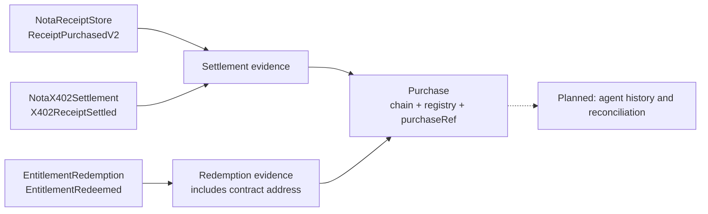

# Graph indexing and historical evidence

[Current evidence summary](../README.md#public-evidence-indexing-with-the-graph)

## Public evidence indexing with The Graph

[`packages/subgraph`](../packages/subgraph) contains the schema, event mappings, and
deterministic tests for a read-only index of Nota purchase and redemption evidence.
**Status reviewed 2026-09-13:** Studio is deployed; both manifests record a new
0.10-USDC mainnet purchase and redemption with `EVENTS_INDEXED_AND_MATCHED` on
2026-09-12. All three Base sources are configured. Decentralized-network publication,
backend queries of the live index, and World authentication remain incomplete.
The zero-event counts below are an older snapshot, not the current demo status.

### Studio deployment and verification evidence

- [Studio: Nota Entitlements](https://thegraph.com/studio/subgraph/nota-entitlements), version `v0.0.1`.
- [Query endpoint](https://api.studio.thegraph.com/query/1753681/nota-entitlements/v0.0.1).
- Deployment CID: `QmQ4y2CoqUvfVmU4cuyvuVQZ9M9EuLfiYy2CzbvQp7NnQp`.
- Machine-readable evidence: [`deployments/subgraph-base.json`](../deployments/subgraph-base.json).

The **earlier 2026-09-12 baseline snapshot** returned `INDEX_COMPATIBILITY_VERIFIED` at finalized snapshot
block **51,208,878**, hash
`0x68dd920f52a5bdac02c99759950abb88b928d53ada1b11efa21fb98c1a1c0cc6`.
Contract wiring and registry authorization were checked separately at block
**51,209,480**. The index reported no indexing errors and passed the freshness,
source and pagination checks. **One existing store settlement** matched receipt #1
against Base RPC; **zero adapter settlements and zero redemptions** were returned.
These counts describe that snapshot, not current totals or proof of a new connected demo.

**Live connected demo indexed (2026-09-12).** The Base mainnet demo purchase
(`purchaseRef` `0xb336…6b94`, listing 2, 0.10 USDC) is indexed by the same deployment
with no indexing errors: its `X402_ADAPTER` settlement
([`0xa5ad9c2e…`](https://basescan.org/tx/0xa5ad9c2e638590a3aa5ef29ca7d5fa99cd98d48f697640ae1b7e506f7473384e),
block 51,220,814, log 247) and redemption
([`0x59207b64…`](https://basescan.org/tx/0x59207b64629b4bff88e5198fc66045bb9bd1429dc3c6b7296f4a2d61a4905194),
block 51,220,820, log 702) matched the recorded transactions, block hashes and Base RPC
log indexes. This covers that one purchase, not event completeness; details are under
`publicDemo.indexVerification` in both deployment manifests.

The first upload failed because the event JSON ABIs omitted explicit `anonymous`
and non-indexed input flags. Those defaults are now explicit in all three ABI files,
with a regression test; the successful deployment above contains the corrected ABIs.
No Solidity change or contract redeployment was required. The corresponding source
is commit `5e9d14b80cd41a31a9f2537b1d1b55ef71e8e24f`, committed after the upload.



The mappings cover the three event types, not every event or every state variable
in the contracts. They never submit transactions or change the settlement and
redemption rules.

| Entity | Identity / meaning |
| --- | --- |
| `Purchase` | `chainId:registry:purchaseRef` joins settlement and redemption evidence; receipt IDs are not join keys |
| `Settlement` | `chainId:transactionHash:logIndex` preserves the emitter, receipt ID, buyer, seller, listing, amount, metadata hash, agent ID, and block provenance |
| `Redemption` | Independent event evidence including `redemptionContract`; there is deliberately no global `Purchase.redeemed` flag |
| `Listing` | `chainId:store:listingId` groups observed settlement references, not a complete catalog or current listing state |

Duplicate processing of the same log is idempotent. Distinct settlement logs claiming
the same reference are retained and marked `CONFLICTED`; later claims do not silently
replace the first buyer or purchase terms. A redemption without indexed purchase
history creates an `UNKNOWN` purchase, not a fabricated receipt. `SETTLED` means an
event was indexed, **not** that the current endpoint authorizes redemption.

The [manifest](../packages/subgraph/subgraph.yaml) pins three static Base data sources,
each starting at its verified creation block:

| Data source | Start block |
| --- | --- |
| Existing `NotaReceiptStore` | `50,536,305` |
| `NotaX402Settlement` | `51,184,074` |
| `EntitlementRedemption` | `51,184,221` |

The new addresses match [`deployments/base.json`](../deployments/base.json) above.
Every source uses the same chain/store/registry context, so adapter settlements and
redemptions join the existing purchase evidence by `chainId:registry:purchaseRef`.
There are no inactive templates, wildcard emitters, or automatic discovery of future
deployments. Configuration tests catch drift in addresses, blocks, context, and handlers.
A hosted subgraph cannot observe contracts deployed only on the local demo fork.

Only public event fields are indexed. The schema contains neither `rawPurchaseRef`
nor `purchaseRefNonce`, and mappings do not inspect redemption calldata. The public
EIP-3009 `authorizationNonce` is a different value, not the private preimage nonce.
A metadata hash proves a commitment, not access to the underlying document or
proof of fulfillment. An event's `agentId` is not human-verification evidence.

Future queries can support purchase history, spending summaries, and candidate
unredeemed purchases **for a selected redemption deployment**. Before acting, the
backend must still check authoritative RPC state, accepted consumers, expected order
terms, and buyer authentication. Missing data, indexing lag/errors, conflicting
claims, or uncertain finality mean **unknown**, not permission to redeem. Live
validation must include indexer health, block freshness, and pagination. Gas and
query infrastructure can incur costs; this adds no new protocol fee and makes no
free-query or free-gas claim.

### Build and test the index

Use Node.js **22** (minimum 20.19), then run from the repository root:

```sh
npm ci
npm run subgraph:build
npm run subgraph:test
```

The build generates types and compiles all three mappings to WASM. Matchstick 0.6.0
executes deterministic tests of the actual AssemblyScript handlers without Base RPC
or Graph credentials. Its first run downloads the platform-specific test runner;
CI uses Ubuntu 22.04 for that binary. ABI parity tests also run with `npm test`.
Generated code, compiled artifacts, and downloaded runners are ignored by Git.

Tooling caveat (recorded during the 2026-09-12 preparation): `npm audit` reported advisories in Graph CLI transitive
development dependencies, including a critical `decompress` archive-extraction
advisory. A successful build does not resolve those findings. Do not use this
toolchain to process untrusted archives or expose its development services; review
the dependency findings before deployment tooling is approved. Existing application
dependency versions are unchanged by this index implementation.

### Live-indexing preparation and verification

The existing store's [creation transaction](https://basescan.org/tx/0x78301d0cffc614a1ad591275a96fbdd413fddb73568d57fe6bda3a37e4055266)
succeeded on Base at block `50,536,305`, with the expected contract address. Its
creation was located through Blockscout and checked against Base RPC. The read-only
preflight rechecks that evidence, the chain ID and registry wiring, and the actual
`ReceiptPurchasedV2` log for [receipt #1](https://basescan.org/tx/0x3b9656b4a67dee38ca2bd28d8841fbb67469c0ed3f9ace2977e5b753e7230978)
at block `50,833,757`, log index `474`. This is **pre-existing receipt evidence**,
not a new purchase or World-registration demonstration. No preimage bundle is needed.

It also checks both new creation receipts against the deployment record, their runtime
code hashes and store/registry wiring, the adapter's USDC address, redemption's exact
accepted set of store + adapter, and the adapter's current registry authorization.
Code and state reads share one RPC block, which is printed in the report; registry
authorization can later be revoked. These are read-only checks, not transactions.
The preflight transport allows only the required read methods. Rate-limit responses
(including Base public RPC's `-32016`) get at most two retries with 5s/10s backoff;
exhausted retries and all other RPC errors fail the check. Each request times out
after 20 seconds. A rate-limited public RPC is not evidence of a contract failure.
The selected RPC must serve historical transaction receipts and blocks as well as
current state; some public providers restrict archive access. There is no automatic
switch to another provider or bypass of failed evidence checks.

Preparation validation on **2026-09-12**: the RPC-only preflight succeeded with
deployment state checked at Base block **51,204,343**. It reported
`RPC_EVIDENCE_VERIFIED_ONLY` and `graphVerified: false`; this did not query a live
subgraph or prove that new purchase/redemption events have been indexed.

```sh
# BASE_RPC_URL must already hold an archive-capable Base endpoint.
export BASE_RPC_URL

# RPC-only preparation: no Graph account, keys, publication, or transactions.
npm run subgraph:preflight

# Recheck the recorded Studio deployment (read-only; public values below).
GRAPH_QUERY_URL=https://api.studio.thegraph.com/query/1753681/nota-entitlements/v0.0.1 \
GRAPH_DEPLOYMENT_ID=QmQ4y2CoqUvfVmU4cuyvuVQZ9M9EuLfiYy2CzbvQp7NnQp \
npm run subgraph:preflight
```

Without `GRAPH_QUERY_URL`, the command reports `RPC_EVIDENCE_VERIFIED_ONLY` with
`graphVerified: false`. With it, the command requires the expected deployment CID,
healthy index metadata and no more than 300 blocks of lag relative to RPC. It
cross-checks the indexed block hash against RPC, selects an indexed, finalized
snapshot after both contracts were deployed, and paginates settlements and redemptions
at that fixed block hash using increasing IDs. Settlement kind/emitter pairs must be
the configured store or adapter; redemptions must come from the configured redemption
contract. Every row must use the expected chain/store/registry and fall between its
source's start block and the selected snapshot.
Missing metadata, GraphQL errors (even with partial data), a changed deployment or
snapshot, invalid cursors, and exhausted page limits all fail the check. The cap is
100 pages of 100 rows per entity type; a larger index requires an explicitly reviewed cap change,
not a partial-success claim. Endpoint URLs and provider error details are not logged.

Success compares receipt #1's public fields and log/block provenance against RPC
and reports `INDEX_COMPATIBILITY_VERIFIED`. This is a compatibility check for that
receipt plus source/pagination checks across the returned store/adapter settlements
and redemptions—not an independent audit of every indexed event and never permission
to redeem. Adapter settlement and redemption counts are reported separately; zero
new events is not proof that those live mappings work. The later connected demo's settlement and redemption were compared separately,
as recorded under `publicDemo.indexVerification` in both manifests. The
recorded Studio endpoint passed the earlier compatibility check on 2026-09-12;
rerun it before relying on a current view. Deterministic tests exercise its failure
cases without credentials.

Next steps: connect agent history/reconciliation to the live index and resolve the
still-open deployment-tool dependency findings. Studio deployment did not resolve
those advisories. Keep deployment keys local; do not commit or paste them into
documentation. Publishing a subgraph to
the decentralized network and any associated on-chain spending require their own
approval. The public purchase-to-redemption evidence is already recorded; do not
create another paid run to reproduce it. Agent reconciliation against the live index
is still future application work. World registration can progress independently.

Implementation references: [Graph manifests](https://thegraph.com/docs/en/subgraphs/developing/creating/subgraph-manifest/),
[GraphQL schemas](https://thegraph.com/docs/en/subgraphs/developing/creating/ql-schema/),
and [Matchstick testing](https://thegraph.com/docs/en/subgraphs/tooling/unit-testing-framework/).
The preflight follows the documented [GraphQL metadata, historical queries, and cursor pagination](https://thegraph.com/docs/en/subgraphs/querying/graphql-api/).
